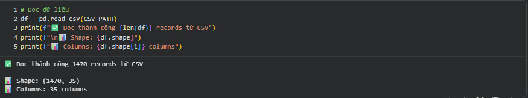
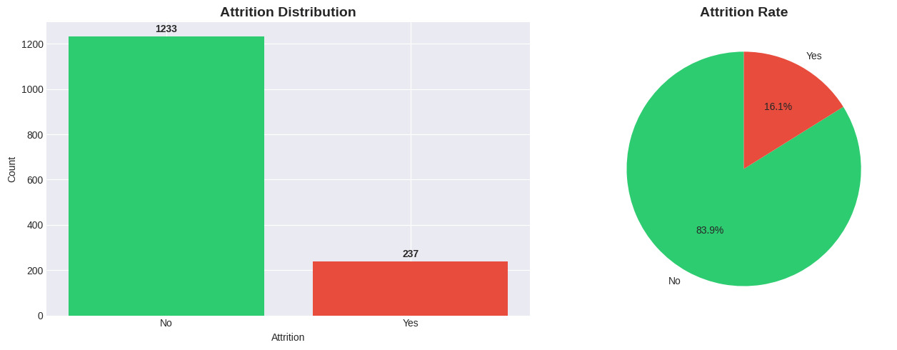
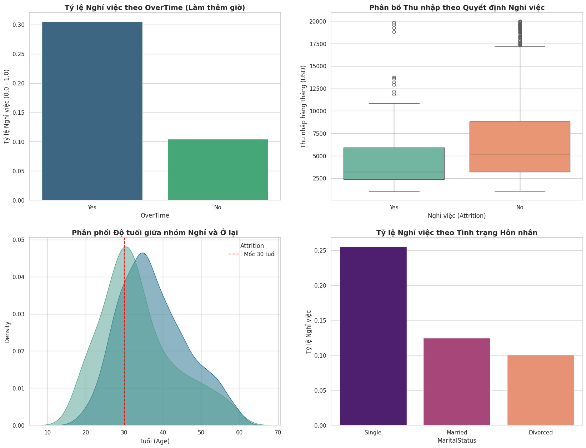
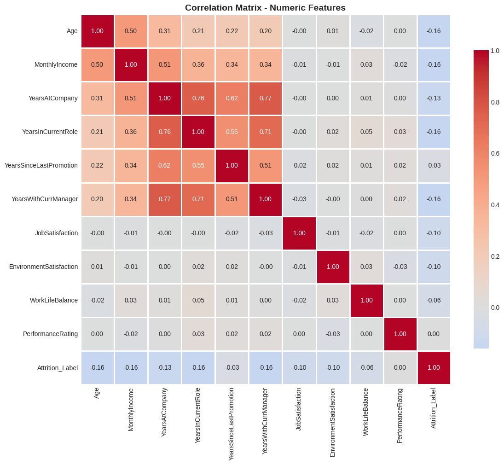

# 1. Quy trình thực hiện

## 1.1. Khởi tạo và chuẩn bị dữ liệu

-   Nguồn dữ liệu: Bộ dữ liệu mẫu IBM HR Analytics Employee Attrition & Performance (định dạng CSV) chứa hồ sơ nhân sự tổng hợp, bao gồm thông tin nhân khẩu học, mức lương và lịch sử làm việc của 1.470 nhân viên (với 35 thuộc tính đặc trưng) .

-   Đọc dữ liệu bằng pandas, hàm pd.read_csv() được sử dụng để tải dữ liệu từ file nguồn vào bộ nhớ (DataFrame) để tiến hành phân tích.



## 1.2. Khám phá dữ liệu (EDA) và chọn lọc đặc trưng

Trước khi đưa vào mô hình, nhóm đã thực hiện phân tích khám phá trên toàn bộ 35 thuộc tính và rút ra các nhận định quan trọng:

- **Mất cân bằng dữ liệu (Imbalanced Data):** Biến mục tiêu `Attrition` phân bố rất lệch: 16.1% Nghỉ việc (Yes) so với 83.9% Ở lại (No).



<p align="center">
  Hình 1: Phân bố Attrion.
</p>
- **Các yếu tố tác động chính (Key Drivers):**

    - **Làm thêm giờ (OverTime):** Nhân viên có làm thêm giờ (Yes) có tỷ lệ nghỉ việc cao vượt trội (gấp ~3 lần nhóm không làm thêm).

 
    - **Thu nhập (MonthlyIncome):** Biểu đồ Boxplot cho thấy nhóm nghỉ việc có mức lương trung vị thấp hơn đáng kể so với nhóm ở lại.

    - **Tuổi & Thâm niên:** Nhóm nhân viên trẻ (dưới 30 tuổi) và thâm niên thấp (TotalWorkingYears thấp) có xu hướng nhảy việc cao nhất.

    - **Tình trạng hôn nhân (MaritalStatus):** Nhóm độc thân (Single) có tỷ lệ nghỉ việc cao hơn nhóm đã kết hôn hoặc ly hôn.
    

<p align="center">
  Hình 2: Phân tích các yếu tố chính tác động đến quyết định nghỉ việc (Attrition Drivers). Kết quả cho thấy Làm thêm giờ (OverTime), Thu nhập thấp, Tuổi đời trẻ và Độc thân là những nguyên nhân hàng đầu.
  </p>

- **Tương quan biến (Correlation Analysis):**

    - Phát hiện hiện tượng đa cộng tuyến mạnh (~0.95) giữa MonthlyIncome và JobLevel.

    - _Quyết định:_ Loại bỏ JobLevel và giữ lại MonthlyIncome vì biến liên tục mang lại nhiều thông tin chi tiết hơn.
    

<p align="center">
  Hình 3: Ma trận tương quan giữa các biến
</p>
## 1.3. Tiền xử lý dữ liệu

Dựa trên kết quả EDA, quy trình tiền xử lý được thực hiện qua 5 bước:

1.    **Chọn lọc đặc trưng (Feature Selection):**

- Để tối ưu hóa hiệu suất mô hình và trải nghiệm người dùng trên ứng dụng, nhóm đã rút gọn từ 35 thuộc tính xuống còn 7 thuộc tính cốt lõi là `OverTime`, `MonthlyIncome`, `Age`, `TotalWorkingYears`, `YearsAtCompany`, `JobSatisfaction`, `MaritalStatus`.

```
selected_columns = [
        'Attrition',           # Target
        'OverTime',            # Feature 1
        'MonthlyIncome',       # Feature 2
        'Age',                 # Feature 3
        'TotalWorkingYears',   # Feature 4
        'YearsAtCompany',      # Feature 5
        'JobSatisfaction',     # Feature 6
        'MaritalStatus'        # Feature 7
    ]

df_reduce = df[selected_columns]
```

2.   **Mã hóa đặc trưng (Encoding):**

- Binary Encoding: Chuyển Attrition (Yes/No) $\rightarrow$ (1/0); OverTime (Yes/No) $\rightarrow$ (1/0).

```
df_reduce['Attrition'] = df_reduce['Attrition'].apply(lambda x: 1 if x == 'Yes' else 0)

df_reduce['OverTime'] = df_reduce['OverTime'].apply(lambda x: 1 if x == 'Yes' else 0)
```

- One-Hot Encoding: Áp dụng cho biến định danh MaritalStatus. Sử dụng tham số drop_first=True để tránh bẫy đa cộng tuyến (Dummy Variable Trap), chỉ giữ lại cột \_Married và \_Single (nếu cả 2 bằng 0 thì hiểu là Divorced).

```
df_reduce = pd.get_dummies(df_reduce, columns=['MaritalStatus'], drop_first=True)
```

3. **Chia tập dữ liệu (Splitting):**

- Tỷ lệ: 80% Train (1176) - 20% Test (294).

- Sử dụng stratify=y để đảm bảo tỷ lệ nghỉ việc trong cả 2 tập là tương đương nhau.

```
X_train, X_test, y_train, y_test = train_test_split(X, y, test_size=0.2, random_state=42, stratify=y)
```

4. **Chuẩn hóa dữ liệu (Feature Scaling):**

- Sử dụng StandardScaler để đưa các biến số (`Age`, `MonthlyIncome`, `TotalWorkingYears`, `YearsAtCompany`, `JobSatisfaction`) về cùng phân phối chuẩn.

```
numeric_cols = ['Age', 'MonthlyIncome', 'TotalWorkingYears', 'YearsAtCompany', 'JobSatisfaction']
scaler = StandardScaler()


X_train[numeric_cols] = scaler.fit_transform(X_train[numeric_cols])

X_test[numeric_cols] = scaler.transform(X_test[numeric_cols])
```


<p align="center">
  Hình 4: Trước và sau khi chuẩn hóa dữ liệu
</p>
5. **Xử lý mất cân bằng (Imbalance Handling):**

- Tập dữ liệu huấn luyện (Train set) ban đầu bị lệch nghiêm trọng về phía lớp nhân viên "Ở lại" (Class 0), khiến mô hình dễ bỏ sót các trường hợp nhân viên "Nghỉ việc" (Class 1). Nhóm sử dụng thuật toán SMOTE để sinh thêm các dữ liệu giả lập (synthetic data) cho lớp thiểu số dựa trên nguyên lý láng giềng gần nhất (k-NN) trong không gian vector đã chuẩn hóa. Kết quả là số lượng mẫu của hai lớp trở nên cân bằng (50/50), giúp mô hình học được các đặc trưng của nhóm nghỉ việc tốt hơn và tránh hiện tượng thiên vị (bias) về nhóm đa số.

```
smote = SMOTE(random_state=42)
X_train_resampled, y_train_resampled = smote.fit_resample(X_train, y_train)
```


<p align="center">
  Hình 5: Trước và sau khi xử lý thêm dữ liệu
</p>
# 2. Mô tả dữ liệu

Sau quá trình chọn lọc, bộ dữ liệu cuối cùng đưa vào huấn luyện bao gồm 8 cột sau:

| STT | Tên thuộc tính    | Kiểu dữ liệu    | Vai trò | Mô tả chi tiết                                                                                   |
| --- | ----------------- | --------------- | ------- | ------------------------------------------------------------------------------------------------ |
| 1   | Attrition         | Binary (0/1)    | Target  | Biến mục tiêu: 1 là Nghỉ việc (Yes), 0 là Ở lại (No).                                            |
| 2   | OverTime          | Binary (0/1)    | Feature | Nhân viên có làm thêm giờ không? (Đây là yếu tố ảnh hưởng mạnh nhất đến quyết định nghỉ việc).   |
| 3   | MonthlyIncome     | Numerical (Int) | Feature | Thu nhập hàng tháng (USD). Phản ánh động lực tài chính.                                          |
| 4   | TotalWorkingYears | Numerical (Int) | Feature | Tổng số năm kinh nghiệm làm việc (kể cả ở công ty cũ).                                           |
| 5   | YearsAtCompany    | Numerical (Int) | Feature | Số năm thâm niên tại công ty hiện tại.                                                           |
| 6   | JobSatisfaction   | Ordinal (1-4)   | Feature | Mức độ hài lòng với công việc hiện tại. Thang đo: 1 (Thấp) đến 4 (Rất cao).                      |
| 7   | MaritalStatus     | Nominal         | Feature | Tình trạng hôn nhân (Single/Married/Divorced). Nhóm Single thường có khả năng nghỉ việc cao hơn. |
