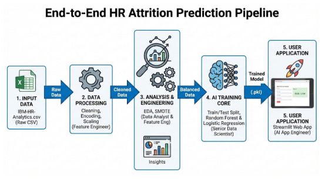
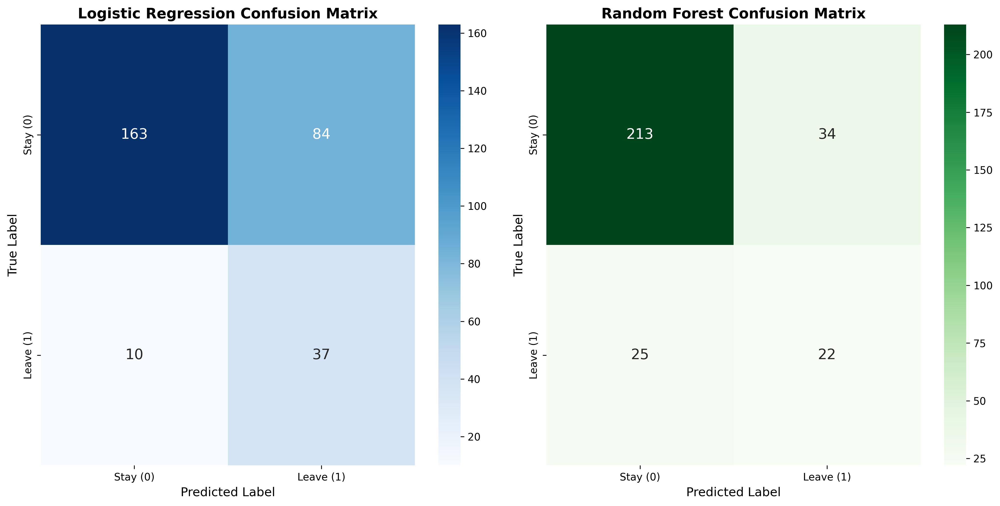
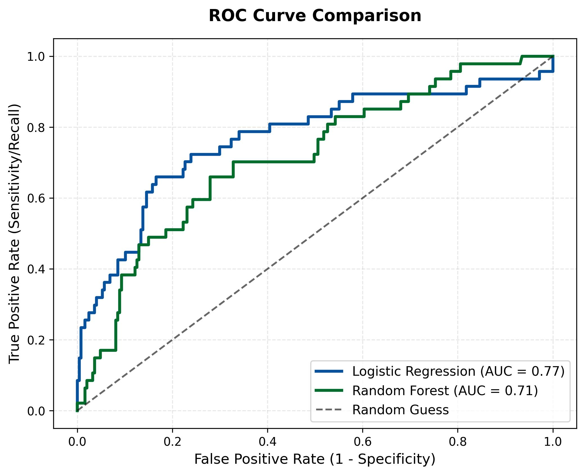
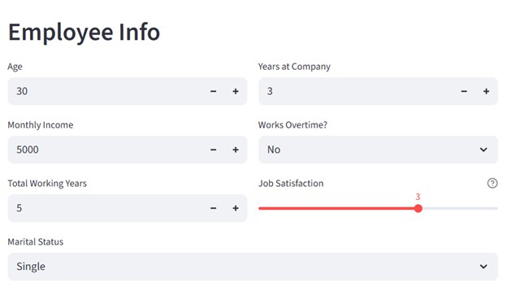
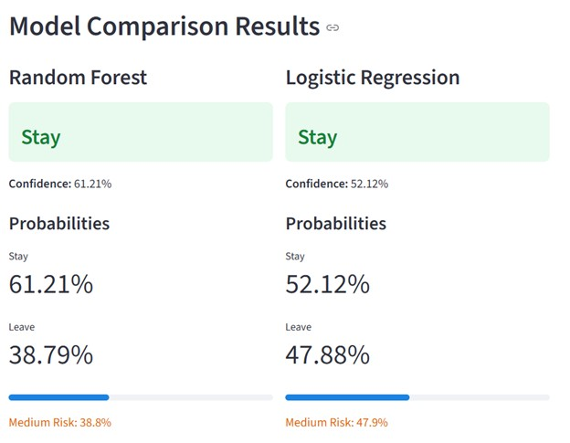

# PROJECT WARMUP ĐỢT 1: DỰ BÁO RỦI RO NGHỈ VIỆC CỦA NHÂN SỰ

**Mô hình đề xuất: Random Forest và Logistic Regression**

# PHẦN 1. TỔNG QUAN VÀ ĐẶT VẤN ĐỀ

## 1.1. Đặt vấn đề

Biến động nhân sự gây tốn kém chi phí lớn cho doanh nghiệp. Thay vì phản ứng thụ động, dự án xây dựng công cụ **dự báo sớm** rủi ro nghỉ việc dựa trên dữ liệu lịch sử, giúp nhà quản lý có chiến lược giữ chân nhân tài chủ động.

## 1.2. Giải pháp đề xuất

Phát triển ứng dụng Web (Streamlit) tích hợp mô hình Machine Learning (Random Forest & Logistic Regression). Hệ thống được tối ưu hóa chỉ với **7 chỉ số đầu vào** cốt lõi (Lương, OT, Tuổi...), giúp việc dự báo diễn ra nhanh chóng và chính xác.

## 1.3. Thách thức kỹ thuật

- **Mất cân bằng dữ liệu (Imbalanced Data):** Tỷ lệ nghỉ việc thực tế rất thấp (16.1%). Nhóm đã sử dụng kỹ thuật **SMOTE** để sinh dữ liệu nhân tạo, giúp mô hình không bị thiên vị nhóm đa số.
- **Đánh đổi giữa Độ chính xác và Tiện dụng:** Việc nhập 35 trường thông tin là quá tải với người dùng. Nhóm đã thực hiện **Feature Selection** để chọn ra 7 biến quan trọng nhất, đảm bảo ứng dụng gọn nhẹ nhưng vẫn duy trì hiệu suất dự báo cao.

# PHẦN 2. QUY TRÌNH THỰC HIỆN

<div align="center">
  
  <br>
  <i>Hình 1: Pipeline tổng quan cho dự án</i>
</div>

## 2.1. Khởi tạo và chuẩn bị dữ liệu

-   Nguồn dữ liệu: Bộ dữ liệu mẫu IBM HR Analytics Employee Attrition & Performance (định dạng CSV) chứa hồ sơ nhân sự tổng hợp, bao gồm thông tin nhân khẩu học, mức lương và lịch sử làm việc của 1.470 nhân viên (với 35 thuộc tính đặc trưng) .

-   Đọc dữ liệu bằng pandas, hàm pd.read_csv() được sử dụng để tải dữ liệu từ file nguồn vào bộ nhớ (DataFrame) để tiến hành phân tích.


## 2.2. Khám phá dữ liệu (EDA) và chọn lọc đặc trưng

Trước khi đưa vào mô hình, nhóm đã thực hiện phân tích khám phá trên toàn bộ 35 thuộc tính và rút ra các nhận định quan trọng:

- **Mất cân bằng dữ liệu (Imbalanced Data):** Biến mục tiêu `Attrition` phân bố rất lệch: 16.1% Nghỉ việc (Yes) so với 83.9% Ở lại (No).


<p align="center">
  Hình 1: Phân bố Attrion.
</p>

- **Các yếu tố tác động chính (Key Drivers):**

    - **Làm thêm giờ (OverTime):** Nhân viên có làm thêm giờ (Yes) có tỷ lệ nghỉ việc cao vượt trội (gấp ~3 lần nhóm không làm thêm).

 
    - **Thu nhập (MonthlyIncome):** Biểu đồ Boxplot cho thấy nhóm nghỉ việc có mức lương trung vị thấp hơn đáng kể so với nhóm ở lại.

    - **Tuổi & Thâm niên:** Nhóm nhân viên trẻ (dưới 30 tuổi) và thâm niên thấp (TotalWorkingYears thấp) có xu hướng nhảy việc cao nhất.

    - **Tình trạng hôn nhân (MaritalStatus):** Nhóm độc thân (Single) có tỷ lệ nghỉ việc cao hơn nhóm đã kết hôn hoặc ly hôn.

    

<p align="center">
  Hình 2: Phân tích các yếu tố chính tác động đến quyết định nghỉ việc (Attrition Drivers). Kết quả cho thấy Làm thêm giờ (OverTime), Thu nhập thấp, Tuổi đời trẻ và Độc thân là những nguyên nhân hàng đầu.
  </p>

- **Tương quan biến (Correlation Analysis):**

    - Phát hiện hiện tượng đa cộng tuyến mạnh (~0.95) giữa MonthlyIncome và JobLevel.

    - _Quyết định:_ Loại bỏ JobLevel và giữ lại MonthlyIncome vì biến liên tục mang lại nhiều thông tin chi tiết hơn.

    

<p align="center">
  Hình 3: Ma trận tương quan giữa các biến.
</p>

## 2.3. Tiền xử lý dữ liệu

Dựa trên kết quả EDA, quy trình tiền xử lý được thực hiện qua 5 bước:

1.    **Chọn lọc đặc trưng (Feature Selection):**

- Để tối ưu hóa hiệu suất mô hình và trải nghiệm người dùng trên ứng dụng, nhóm đã rút gọn từ 35 thuộc tính xuống còn 7 thuộc tính cốt lõi là `OverTime`, `MonthlyIncome`, `Age`, `TotalWorkingYears`, `YearsAtCompany`, `JobSatisfaction`, `MaritalStatus`.

```python
selected_columns = [
        'Attrition',           # Target
        'OverTime',            # Feature 1
        'MonthlyIncome',       # Feature 2
        'Age',                 # Feature 3
        'TotalWorkingYears',   # Feature 4
        'YearsAtCompany',      # Feature 5
        'JobSatisfaction',     # Feature 6
        'MaritalStatus'        # Feature 7
    ]

df = df[selected_columns]
```

2.   **Mã hóa đặc trưng (Encoding):**

- Binary Encoding: Chuyển Attrition (Yes/No) $\rightarrow$ (1/0); OverTime (Yes/No) $\rightarrow$ (1/0).

```python
df['Attrition'] = df['Attrition'].apply(lambda x: 1 if x == 'Yes' else 0)
df['OverTime'] = df['OverTime'].apply(lambda x: 1 if x == 'Yes' else 0)
```

- One-Hot Encoding: Áp dụng cho biến định danh MaritalStatus. Sử dụng tham số drop_first=True để tránh bẫy đa cộng tuyến (Dummy Variable Trap), chỉ giữ lại cột \_Married và \_Single (nếu cả 2 bằng 0 thì hiểu là Divorced).

```python
df_reduce = pd.get_dummies(df_reduce, columns=['MaritalStatus'], drop_first=True)
```

3. **Chia tập dữ liệu (Splitting):**

- Tỷ lệ: 80% Train (1176) - 20% Test (294).

- Sử dụng stratify=y để đảm bảo tỷ lệ nghỉ việc trong cả 2 tập là tương đương nhau.

```python
X_train, X_test, y_train, y_test = train_test_split(X, y, test_size=0.2, random_state=42, stratify=y)
```

4. **Chuẩn hóa dữ liệu (Feature Scaling):**

Sử dụng StandardScaler để đưa các biến số (`Age`, `MonthlyIncome`, `TotalWorkingYears`, `YearsAtCompany`, `JobSatisfaction`) về cùng phân phối chuẩn.

```python
numeric_cols = ['Age', 'MonthlyIncome', 'TotalWorkingYears', 'YearsAtCompany', 'JobSatisfaction']
scaler = StandardScaler()

X_train[numeric_cols] = scaler.fit_transform(X_train[numeric_cols])
X_test[numeric_cols] = scaler.transform(X_test[numeric_cols])
```


<p align="center">
  Hình 4: Trước và sau khi chuẩn hóa dữ liệu.
</p>

5. **Xử lý mất cân bằng (Imbalance Handling):**

Tập dữ liệu huấn luyện (Train set) ban đầu bị lệch nghiêm trọng về phía lớp nhân viên "Ở lại" (Class 0), khiến mô hình dễ bỏ sót các trường hợp nhân viên "Nghỉ việc" (Class 1). Nhóm sử dụng thuật toán SMOTE để sinh thêm các dữ liệu giả lập (synthetic data) cho lớp thiểu số dựa trên nguyên lý láng giềng gần nhất (k-NN) trong không gian vector đã chuẩn hóa. Kết quả là số lượng mẫu của hai lớp trở nên cân bằng (50/50), giúp mô hình học được các đặc trưng của nhóm nghỉ việc tốt hơn và tránh hiện tượng thiên vị (bias) về nhóm đa số.

```python
smote = SMOTE(random_state=42)
X_train_resampled, y_train_resampled = smote.fit_resample(X_train, y_train)
```


<p align="center">
  Hình 5: Trước và sau khi xử lý thêm dữ liệu.
</p>

# 2. Mô tả dữ liệu

Sau quá trình chọn lọc, bộ dữ liệu cuối cùng đưa vào huấn luyện bao gồm 8 cột sau:

| STT | Tên thuộc tính    | Kiểu dữ liệu    | Vai trò | Mô tả chi tiết                                                                                   |
| --- | ----------------- | --------------- | ------- | ------------------------------------------------------------------------------------------------ |
| 1   | Attrition         | Binary (0/1)    | Target  | Biến mục tiêu: 1 là Nghỉ việc (Yes), 0 là Ở lại (No).                                            |
| 2   | OverTime          | Binary (0/1)    | Feature | Nhân viên có làm thêm giờ không? (Đây là yếu tố ảnh hưởng mạnh nhất đến quyết định nghỉ việc).   |
| 3   | MonthlyIncome     | Numerical (Int) | Feature | Thu nhập hàng tháng (USD). Phản ánh động lực tài chính.                                          |
| 4   | TotalWorkingYears | Numerical (Int) | Feature | Tổng số năm kinh nghiệm làm việc (kể cả ở công ty cũ).                                           |
| 5   | YearsAtCompany    | Numerical (Int) | Feature | Số năm thâm niên tại công ty hiện tại.                                                           |
| 6   | JobSatisfaction   | Ordinal (1-4)   | Feature | Mức độ hài lòng với công việc hiện tại. Thang đo: 1 (Thấp) đến 4 (Rất cao).                      |
| 7   | MaritalStatus     | Nominal         | Feature | Tình trạng hôn nhân (Single/Married/Divorced). Nhóm Single thường có khả năng nghỉ việc cao hơn. |

# PHẦN 3. HUẤN LUYỆN VÀ ĐÁNH GIÁ MÔ HÌNH

Sau khi hoàn tất tiền xử lý dữ liệu, nhóm tiến hành huấn luyện hai mô hình học máy phổ biến là Logistic Regression và Random Forest. Đây là hai thuật toán đại diện cho hai hướng tiếp cận khác nhau: tuyến tính (linear) và phi tuyến tính (non-linear/ensemble), giúp đưa ra cái nhìn đa chiều về khả năng dự báo.

## 3.1. Lựa chọn và Cấu hình Mô hình

### 3.1.1. Logistic Regression

Lý do lựa chọn:

- Là thuật toán cơ bản cho bài toán phân loại nhị phân (Binary Classification).

- Dễ diễn giải (interpretable): Trọng số (weights) của mô hình cho biết mức độ ảnh hưởng tích cực hoặc tiêu cực của từng đặc trưng đến khả năng nghỉ việc.

- Hoạt động tốt với dữ liệu đã được chuẩn hóa (StandardScaler) và có số lượng đặc trưng nhỏ (7 features).

Cấu hình tham số:

- max_iter=1000: Tăng số vòng lặp tối đa để đảm bảo thuật toán hội tụ (converge), do dữ liệu đã qua xử lý SMOTE có thể phức tạp hơn.

- random_state=42: Đảm bảo kết quả có thể tái lập.

```python
from sklearn.linear_model import LogisticRegression

def train_logistic_regression(X_train, y_train):
    model = LogisticRegression(max_iter=1000, random_state=42)
    model.fit(X_train, y_train)
    return model
```

### 3.1.2. Random Forest Classifier

Lý do lựa chọn:

- Là phương pháp học kết hợp (Ensemble Learning), giúp giảm thiểu rủi ro quá khớp (Overfitting) thường gặp ở cây quyết định đơn lẻ.

- Có khả năng xử lý tốt các mối quan hệ phi tuyến tính phức tạp giữa các đặc trưng nhân sự (ví dụ: sự tương tác giữa Tuổi tác và Mức lương tác động đến quyết định nghỉ việc).

- Mạnh mẽ (Robust) trước nhiễu và không yêu cầu dữ liệu phải tuân theo phân phối chuẩn quá khắt khe.

Cấu hình tham số:

- n_estimators=100: Xây dựng tập hợp gồm 100 cây quyết định để đưa ra kết quả dự báo ổn định (thông qua cơ chế bỏ phiếu đa số).

- max_depth=10: Giới hạn độ sâu tối đa của mỗi cây để kiểm soát độ phức tạp mô hình, tránh việc học quá chi tiết dữ liệu nhiễu.

- n_jobs=-1: Tận dụng toàn bộ các lõi CPU có sẵn của hệ thống để tối ưu hóa tốc độ huấn luyện song song.

- random_state=42: Đảm bảo tính nhất quán của kết quả huấn luyện trong mọi lần chạy.

```python
from sklearn.ensemble import RandomForestClassifier

def train_random_forest(X_train, y_train):
    model = RandomForestClassifier(n_estimators=100, max_depth=10, random_state=42, n_jobs=-1)
    model.fit(X_train, y_train)
    return model
```
## 3.2 Đánh giá Hiệu suất (Model Evaluation)

Việc đánh giá được thực hiện trên tập kiểm thử (X_test, y_test) - tập dữ liệu hoàn toàn mới mà mô hình chưa từng "nhìn thấy" trong quá trình huấn luyện.

### 3.2.1. Các chỉ số đánh giá (Metrics)

Để đánh giá hiệu suất mô hình một cách toàn diện, nhóm sử dụng 4 chỉ số cơ bản dựa trên các thành phần của Confusion Matrix: **TP** (True Positive), **TN** (True Negative), **FP** (False Positive), **FN** (False Negative).

1.  **Accuracy (Độ chính xác tổng thể):**
    Tỷ lệ dự đoán đúng trên tổng số mẫu quan sát.
    $$ \text{Accuracy} = \frac{TP + TN}{TP + TN + FP + FN} $$

2.  **Precision (Độ chính xác của lớp dự đoán):**
    Trong số các nhân viên được mô hình dự đoán là "Nghỉ việc", bao nhiêu phần trăm thực sự nghỉ?
    $$ \text{Precision} = \frac{TP}{TP + FP} $$

3.  **Recall (Độ nhạy - Sensitivity):**
    Mô hình phát hiện được bao nhiêu phần trăm nhân viên nghỉ việc thực tế? *Đây là chỉ số quan trọng nhất trong bài toán giữ chân nhân tài.*
    $$ \text{Recall} = \frac{TP}{TP + FN} $$

4.  **F1-Score:**
    Trung bình điều hòa của Precision và Recall, giúp đánh giá mô hình khi dữ liệu mất cân bằng.
    $$ \text{F1-Score} = 2 \times \frac{\text{Precision} \times \text{Recall}}{\text{Precision} + \text{Recall}} $$

```python
from sklearn.metrics import accuracy_score, classification_report

def evaluate_model(model, X_test, y_test, model_name="Model"):
    y_pred = model.predict(X_test)
    acc = accuracy_score(y_test, y_pred)
    print(classification_report(y_test, y_pred))
    return acc
```

### 3.2.2. Kết quả Đánh giá Thực nghiệm

Để đánh giá hiệu quả thực tế, nhóm tiến hành kiểm thử trên tập dữ liệu Test (gồm 294 mẫu hoàn toàn mới). Kết quả được phân tích thông qua biểu đồ Ma trận nhầm lẫn (Confusion Matrix) và bảng chỉ số chi tiết.



<p align="center">
  Hình 6: So sánh Confusion Matrix trên tập kiểm thử.
</p>

```path
Logistic Regression Accuracy: 0.6803
              precision    recall  f1-score   support

           0       0.94      0.66      0.78       247
           1       0.31      0.79      0.44        47

    accuracy                           0.68       294
   macro avg       0.62      0.72      0.61       294
weighted avg       0.84      0.68      0.72       294


Random Forest Accuracy: 0.7993
              precision    recall  f1-score   support

           0       0.89      0.86      0.88       247
           1       0.39      0.47      0.43        47

    accuracy                           0.80       294
   macro avg       0.64      0.67      0.65       294
weighted avg       0.81      0.80      0.81       294
```

Dựa trên kết quả thực nghiệm, rút ra được các nhận định quan trọng:

1. Logistic Regression:

- Điểm mạnh: Chỉ số Recall cho lớp Nghỉ việc đạt tới 79% (phát hiện đúng 37/47 trường hợp). Đây là ưu điểm lớn nhất, giúp doanh nghiệp không bỏ lọt các nhân sự đang có ý định rời đi.

- Hạn chế: Độ chính xác tổng thể thấp (68%) do tỷ lệ báo động giả (False Positive) quá cao. Có tới 84 nhân viên trung thành bị dự đoán nhầm là sẽ nghỉ.

2. Random Forest:

- Điểm mạnh: Độ chính xác tổng thể (Accuracy) rất cao, đạt ~80%. Mô hình hoạt động ổn định, ít báo động sai (chỉ nhầm 34 trường hợp so với 84 của Logistic).

- Hạn chế: Khả năng phát hiện rủi ro kém. Chỉ số Recall cho lớp Nghỉ việc chỉ đạt 47% (bỏ sót 25/47 trường hợp), đồng nghĩa với việc hơn một nửa số nhân viên có nguy cơ nghỉ việc sẽ không được hệ thống cảnh báo.

### 3.2.3. Biểu đồ đường cong ROC

Để có cái nhìn khách quan hơn về khả năng phân loại của hai mô hình ở các ngưỡng (threshold) khác nhau, nhóm sử dụng biểu đồ ROC và chỉ số diện tích dưới đường cong (AUC).



<p align="center">
  Hình 7: Biểu đồ đường cong ROC so sánh hai mô hình.
</p>

Logistic Regression (Đường màu xanh dương), đường cong này vươn cao hơn rõ rệt và bao phủ diện tích lớn hơn với chỉ số AUC đạt 0.77. Điều này khẳng định mô hình tuyến tính này hoạt động hiệu quả hơn trong việc phân tách giữa hai lớp dữ liệu, đặc biệt là khả năng duy trì tỷ lệ phát hiện đúng (True Positive Rate) ở mức cao ngay cả khi chấp nhận một tỷ lệ báo động giả thấp.

Random Forest (Đường màu xanh lá), đường cong nằm thấp hơn với chỉ số AUC chỉ đạt 0.71. Mặc dù là mô hình phức tạp hơn, nhưng trong trường hợp này Random Forest lại tỏ ra kém hiệu quả hơn trong việc xếp hạng xác suất rủi ro so với Logistic Regression. Đường cong của nó có xu hướng đi là là gần đường chéo ngẫu nhiên hơn, phản ánh sự khó khăn trong việc phân biệt rõ ràng các trường hợp nhân viên sắp nghỉ việc.

# PHẦN 4. TRIỂN KHAI ỨNG DỤNG

## 4.1. Giới thiệu về Deploy mô hình Machine Learning

Sau khi hoàn thành quá trình xử lý dữ liệu và xây dựng mô hình Machine Learning, bước tiếp theo là triển khai (deploy) mô hình thành một ứng dụng thực tế để người dùng có thể sử dụng. Việc deploy giúp mô hình không chỉ dừng lại ở mức thử nghiệm mà có thể áp dụng vào thực tế, hỗ
trợ dự đoán hoặc ra quyết định.

Trong dự án này, nhóm sử dụng Streamlit để triển khai mô hình. Streamlit là một framework Python cho phép xây dựng giao diện web đơn giản và nhanh chóng dành cho các ứng dụng Data Science và Machine Learning.

## 4.2. Lý do lựa chọn Streamlit

Streamlit được lựa chọn do các ưu điểm sau:

- **Dễ sử dụng:** Không yêu cầu kiến thức chuyên sâu về Front-end.
- **Tích hợp tốt với Python:** Phù hợp với các mô hình Machine Learning đã được xây dựng bằng Python.
- **Triển khai nhanh:** Chỉ cần viết vài dòng lệnh là có thể tạo giao diện web.
- **Hỗ trợ visualization:** Có thể hiển thị biểu đồ và kết quả phân tích trực quan.

## 4.3. Quy trình triển khai ứng dụng Streamlit

### 4.3.1 Cài đặt các thư viện cần thiết

```python
pip install streamlit
pip install scikit-learn
pip install pandas
pip install joblib
```

### 4.3.2 Xây dựng UI

#### a. Phần Input của người dùng



Để xây dụng được UI như thế này, ta cần chia thành 2 cột:

```python
col1, col2 = st.columns(2)
```

Với cột bên trái, ta cần hiện thị các input của biến ‘age’, ‘Monthly Income’, ‘Total Working Years’

```python
col1, col2 = st.columns(2)

with col1:
    age = st.number_input("Age", min_value=18, max_value=65, value=30)
    monthly_income = st.number_input("Monthly Income", min_value=1000, max_value=20000, value=5000)
    total_working_years = st.number_input("Total Working Years", min_value=0, max_value=40, value=5)
```

Với cột bên phải, ta cần hiện thị các input của biến ‘Year at Company’, ‘Over Time’, ‘Mức độ hài với công việc.

```python
with col2:
    years_at_company = st.number_input("Years at Company", min_value=0, max_value=40, value=3)
    overtime = st.selectbox("Works Overtime?", ["No", "Yes"])
    job_satisfaction = st.slider(
        "Job Satisfaction",
        min_value=1,
        max_value=4,
        value=3,
        help="1: Low, 2: Medium, 3: High, 4: Very High"
    )

marital_status = st.selectbox(
    "Marital Status",
    ["Single", "Married", "Divorced"]
)
```

---

#### b. UI hiển thị kết quả dự đoán



Giao diện được chia thành hai cột song song bằng cách sử dụng st.columns(2):

Cột 1: Hiển thị kết quả của mô hình Random Forest

Cột 2: Hiển thị kết quả của mô hình Logistic Regression

Cách bố trí này giúp người dùng có thể so sánh hai mô hình một cách trực quan và thuận tiện.

```python
col1, col2 = st.columns(2)

with col1:
    st.subheader("Random Forest")
    if rf_prediction == 1:
        st.error(f"{rf_result}")
    else:
        st.success(f"### {rf_result}")
    st.markdown(f"**Confidence:** {rf_conf:.2f}%")

    st.markdown("#### Probabilities")
    st.metric("Stay", f"{rf_probabilities[0]*100:.2f}%")
    st.metric("Leave", f"{rf_probabilities[1]*100:.2f}%")

    st.progress(float(rf_probabilities[1]))
    leave_prob_rf = rf_probabilities[1] * 100
    if leave_prob_rf < 30:
        st.markdown(f":green[Low Risk: {leave_prob_rf:.1f}%]")
    elif leave_prob_rf < 60:
        st.markdown(f":orange[Medium Risk: {leave_prob_rf:.1f}%]")
    else:
        st.markdown(f":red[High Risk: {leave_prob_rf:.1f}%]")

with col2:
    st.subheader("Logistic Regression")
    if lr_prediction == 1:
        st.error(f"### {lr_result}")
    else:
        st.success(f"### {lr_result}")
    st.markdown(f"**Confidence:** {lr_conf:.2f}%")

    st.markdown("#### Probabilities")
    st.metric("Stay", f"{lr_probabilities[0]*100:.2f}%")
    st.metric("Leave", f"{lr_probabilities[1]*100:.2f}%")

    st.progress(float(lr_probabilities[1]))
```

---

## 4.4 Hạn chế và hướng phát triển

### Hạn chế

- Giao diện Streamlit còn đơn giản
- Khả năng xử lý dữ liệu lớn còn hạn chế
- Chưa tối ưu hiệu suất mô hình

### Hướng phát triển

- Tối ưu giao diện người dùng
- Tích hợp nhiều mô hình dự đoán
- Triển khai trên server để phục vụ nhiều người dùng đồng thời
- Triển khai trên cloud để cho mọi người khác sử dụng thử mô hình (Hugging Face)
