## 1. GIỚI THIỆU
Trong thế giới Dữ liệu, SQL (Structured Query Language) và Pandas là hai công cụ "gối đầu giường" nhưng mang tư duy hoàn toàn khác biệt:

Bài viết này tập trung vào viết code thực chiến, giúp bạn đối chiếu trực tiếp các mệnh đề SQL quen thuộc sang phương thức Pandas thông qua bộ dữ liệu Superstore.
## 2. CẤU TRÚC DỮ LIỆU
### 2.1. Làm quen với các câu lệnh cơ bản trong SQL

<div align="center">
  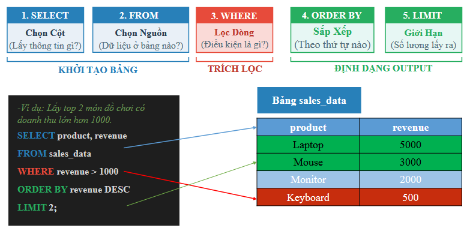
</div>

Các cú pháp cơ bản của câu lệnh SELECT, trong đó, [...] dùng cho các nội dung tùy chọn khi người dùng có thể chỉ định hoặc không:

```SQL
SELECT select_list
[ FROM table_source ]
[ WHERE search_condition ]
[ GROUP BY group_by_expression ]
[ HAVING search_condition ]
[ ORDER BY order_expression [ ASC | DESC ] ]
```

**Mệnh đề `SELECT`**: liệt kê các trường dữ liệu (cột) hoặc các hàm tính toán trên các trường dữ liệu cần trả về trong câu truy vấn. Lưu ý là các trường dữ liệu này phải tồn tại trong các bảng dữ liệu trong mệnh đề `FROM`.
**Mệnh đề `FROM`**: liệt kê các bảng dữ liệu và/hoặc kết hợp với các phép `JOIN` trên các bảng dữ liệu cần truy vấn.
**Mệnh đề `WHERE`**: xác định điều kiện lọc dữ liệu.
**Mệnh đề `GROUP BY`**: gom nhóm các trường dữ liệu cần xử lý.
**Mệnh đề `HAVING`**: xác định điều kiện lọc dữ liệu sau khi gom nhóm và thực hiện tính toán trên nhóm nếu có.
**Mệnh đề `ORDER BY`**: xác định dữ liệu sẽ sắp xếp thứ tự theo các trường dữ liệu nào và theo thứ tự tăng dần (`ASC`) hay giảm dần (`DESC`).
Các vấn đề cần lưu ý khác:
- Đối với SQL, thứ tự xử lý cơ bản của câu lệnh truy vấn từ trái sang phải như sau: `FROM`, `WHERE`, `GROUP BY`, `HAVING`, `SELECT`, `ORDER BY`.
- Các phép toán, hàm có thể thay đổi ở các hệ quản trị cơ sở dữ liệu (RDBMS) khác nhau. Ví dụ toán tử `||` sử dụng để nối chuỗi trong Oracle nhưng `+` sử dụng để nối chuỗi trong MS SQL Server.
- Sử dụng ký tự đặc biệt `*` trong mệnh đề `SELECT` để lấy hết các trường dữ liệu.
- Sử dụng `is Null` hoặc `is not Null` để so sánh bằng hoặc khác giá trị rỗng, chưa biết.
- Sử dụng phép toán `LIKE` để so sánh giá trị chuỗi với một mẫu cần tìm.
- Có thể sử dụng mệnh đề `AS` để đổi tên trường dữ liệu hiển thị trong mệnh đề `SELECT` hoặc đổi tên bảng dữ liệu để có tên tham chiếu ngắn gọn trong mệnh đề `FROM`.
- Sử dụng `DISTINCT` để loại bỏ giá trị trùng lặp.
- Sử dụng `LIMIT` để giới hạn số dòng trả về.

### 2.2. Làm quen với các câu lệnh cơ bản trong Pandas

Cách Pandas thực hiện các mệnh đề tương ứng:

``` python
import pandas as pd

# Giả sử table_source là một DataFrame (df)
result = (
    table_source[where_condition]                      # WHERE
    .groupby(group_by_expression)[select_list]         # GROUP BY & SELECT
    .sum()                                  # Hàm tổng hợp (SUM, MEAN, COUNT...)
    .loc[having_condition]                  # HAVING 
    .sort_values(by=order_expression, 
                 ascending=True)            # ORDER BY (True: ASC, False: DESC)
    .reset_index()                          # Đưa index về lại thành cột
)
```

- **`df[where_condition]` (Boolean Indexing):** Đóng vai trò như mệnh đề `WHERE`, dùng các mặt nạ boolean để lọc các hàng thỏa mãn điều kiện trước khi tính toán.


- **`.groupby(group_by_expression)`:** Tương đương `GROUP BY`, nhưng khác với SQL, Pandas tạo ra một đối tượng `DataFrameGroupBy`, bắt buộc phải đi kèm một hàm tổng hợp (như `.sum()`, `.mean()`, `.agg()`) ngay sau đó để ra kết quả.


- **`[select_list]`:** Trong Pandas, việc chọn cột (`SELECT`) thường diễn ra đồng thời với lúc gọi hàm tổng hợp hoặc được lọc ngay từ đầu để tối ưu bộ nhớ.


- **`.loc[having_condition]`:** Đóng vai trò như `HAVING`. Do Pandas áp dụng tuần tự từ trên xuống, `.loc` đặt sau hàm tổng hợp sẽ lọc trên kết quả đã được gom nhóm.


- **`.sort_values()`:** Hoàn toàn tương đương với `ORDER BY`.


- **`.reset_index()`:** Đây là thao tác bắt buộc trong Pandas để biến kết quả trả về giống với cấu trúc bảng của SQL. Vì hàm `.groupby()` mặc định sẽ biến các cột gom nhóm thành `Index` (chỉ mục), `.reset_index()` giúp đẩy các chỉ mục này trở lại thành cột dữ liệu bình thường.
## **3. Thực hành với Superstore Dataset**
### 3.1. Thu thập dữ liệu
Trong phần thực hành này, chúng ta sử dụng bộ dữ liệu Superstore:
- Các bạn có thể tải bộ dữ liệu tại link: [Google Drive](https://drive.google.com/file/d/1zyCw50vlD3pWHDnM-rhBqLXeTy4S1c05/view?usp=drive_link), [Kaggle](https://www.kaggle.com/datasets/vivek468/superstore-dataset-final).

- Bảng mô tả bộ dữ liệu:

| **Tên Cột**       | **Mô Tả Chi Tiết**                                  |
| ----------------- | --------------------------------------------------- |
| **row_id**        | Mã định danh duy nhất cho mỗi dòng dữ liệu.         |
| **order_id**      | Mã đơn hàng duy nhất cho mỗi khách hàng.            |
| **order_date**    | Ngày đặt hàng sản phẩm.                             |
| **ship_date**     | Ngày vận chuyển sản phẩm.                           |
| **ship_mode**     | Hình thức vận chuyển do khách hàng chỉ định.        |
| **customer_id**   | Mã định danh duy nhất để phân biệt từng khách hàng. |
| **customer_name** | Tên của khách hàng.                                 |
| **segment**       | Phân khúc khách hàng                                |
| **country**       | Quốc gia nơi khách hàng cư trú.                     |
| **city**          | Thành phố nơi khách hàng cư trú.                    |
| **state**         | Bang/Tỉnh nơi khách hàng cư trú.                    |
| **postal_code**   | Mã bưu chính của khách hàng.                        |
| **region**        | Khu vực địa lý của khách hàng.                      |
| **product_id**    | Mã định danh duy nhất cho sản phẩm.                 |
| **category**      | Danh mục chính của sản phẩm được đặt.               |
| **sub_category**  | Danh mục phụ của sản phẩm được đặt.                 |
| **product_name**  | Tên sản phẩm.                                       |
| **sales**         | Doanh số của sản phẩm.                              |
| **quantity**      | Số lượng sản phẩm.                                  |
| **discount**      | Mức chiết khấu được áp dụng.                        |
| **profit**        | Lợi nhuận hoặc mức lỗ phát sinh.                    |
   
### 3.2. Load dữ liệu
- Thực hành truy vấn bằng SQL trên nền tảng SQL Oneline Platform: Các bạn truy cập vào đường link [runsql](https://runsql.com/r)
	- Đổi database engine sang MySQL 8.4 và thêm data.
	- Xem chi tiết dữ liệu tại mục 2 Define Data.
	
		![[import_data.png]]

- Thực hành truy vấn bằng Pandas trên [Google Colab](https://colab.research.google.com/).
	- Thêm thư viện Pandas đọc dữ liệu và lưu vào DataFrame:
	
		```
		import pandas as pd
		data = pd.read_csv('/content/superstore.csv')
		df = pd.DataFrame(data)
		df.shape   # Output: (9994, 21)
		```

### 3.3. Khám phá và lọc dữ liệu
**Câu 1: Làm quen với dữ liệu**
- **Mục tiêu:** Hiển thị 5 dòng dữ liệu đầu tiên để xem cấu trúc bảng.
- **SQL:** 
```SQL
SELECT *
FROM superstore
LIMIT 5
```
- **Pandas:**
```python
df.head()
```
- **Kết quả**:

![[quest01.png]]


**Câu 2: Lọc dữ liệu và chọn các cột cụ thể**
- **Mục tiêu:** Hiển thị xem thử 5 đơn hàng ở khu vực miền Tây, và chỉ cần biết thông tin về Vùng, Tên sản phẩm và Doanh số của các đơn đó.
- **SQL:** 
```SQL
SELECT region, product_name, sales 
FROM superstore
WHERE region = 'West'
LIMIT 5
```
- **Pandas:**
```python
result = df.loc[df['region'] == 'West', ['region', 'product_name', 'sales']].head()
```
- **Kết quả:**

<div align="center">
  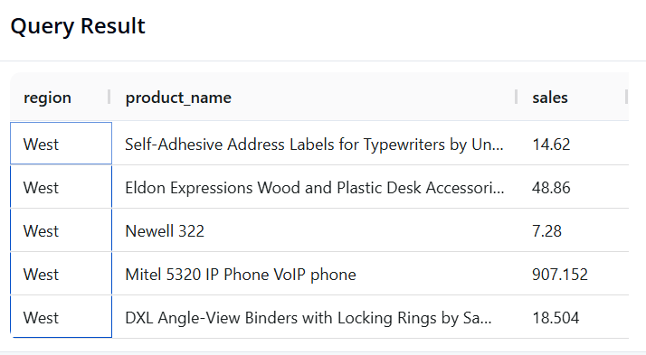
</div>

### 3.4 Gom nhóm và Tổng hợp
**Câu 3: Tính toán KPI Tổng quan**

- **Mục tiêu:** Tính Tổng doanh thu, Tổng số đơn hàng (mã `order_id` duy nhất) và Tổng số lượng khách hàng duy nhất của toàn bộ cửa hàng.
- **SQL:** 
```SQL
SELECT SUM(sales) AS revenue,
       COUNT(DISTINCT order_id) AS total_orders,
       COUNT(DISTINCT customer_id) AS unique_customers
FROM superstore;
```
- **Pandas:**
```python
pd.DataFrame({
    'revenue': [df['sales'].sum()],
    'total_orders': [df['order_id'].nunique()],
    'unique_customers': [df['customer_id'].nunique()]
})
```
- **Kết quả:**
<div align="center">
  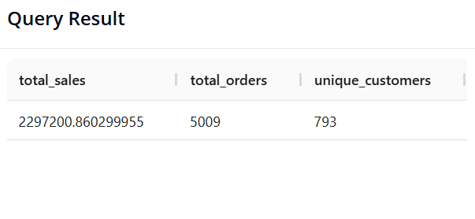
</div>

**Câu 4: Tổng doanh thu theo từng Vùng**

- **Mục tiêu:** Phân tích Vùng (`region`) nào mang lại doanh số lớn nhất, sắp xếp từ cao xuống thấp.
- **SQL:**
```SQL
SELECT region, SUM(sales) AS revenue
FROM superstore
GROUP BY region
ORDER BY revenue DESC
```
- **Pandas:**
```python
(df.groupby('region')['sales']
   .sum()
   .reset_index(name='revenue')
   .sort_values(by='revenue', ascending=False)
)
```
- **Kết quả:**
<div align="center">
  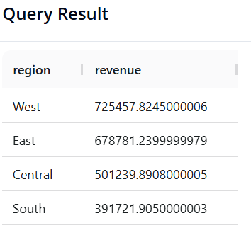
</div>

**Câu 5: Lợi nhuận theo Danh mục sản phẩm**

- **Mục tiêu:** Xác định Danh mục (`category`) nào tạo ra nhiều lợi nhuận nhất.
- **SQL:**
```sql
SELECT category, SUM(profit) AS total_profit
FROM superstore
GROUP BY category
ORDER BY total_profit DESC
```
- **Pandas:**
```python
(df.groupby('category')['profit']
   .sum()
   .reset_index(name='total_profit')
   .sort_values(by='total_profit', ascending=False)
)
```
- **Kết quả:**
<div align="center">
  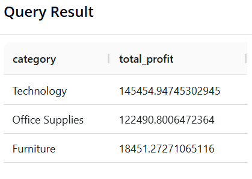
</div>

**Câu 6: Top 5 Sản phẩm "Ngôi sao" doanh số**

- **Mục tiêu:** Tìm 5 sản phẩm (`product_name`) có tổng doanh số cao nhất.
- **SQL:**
```sql
SELECT product_name, SUM(sales) AS revenue
FROM superstore
GROUP BY product_name
ORDER BY revenue DESC
LIMIT 5
```
- **Pandas:**
```python
(df.groupby('product_name')['sales']
   .sum()
   .reset_index(name='revenue')
   .sort_values(by='revenue', ascending=False)
   .head(5)
)
```

- **Kết quả:**
<div align="center">
  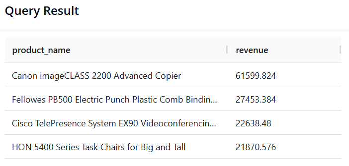
</div>

### 3.5. Đa chiều và Xử lý chuỗi thời gian
**Câu 7: Phân tích đa cấp (Danh mục và Danh mục phụ)**

- **Mục tiêu:** Gom nhóm kết hợp theo `category` và `sub_category` để xem chi tiết mảng nào mang lại doanh thu cao nhất.
- **SQL:**
```sql
SELECT category, sub_category, SUM(sales) AS revenue
FROM superstore
GROUP BY category, sub_category
ORDER BY revenue DESC
```
- **Pandas:**
```python
(df.groupby(['category', 'sub_category'])['sales']
   .sum()
   .reset_index(name='revenue')
   .sort_values(by='revenue', ascending=False)
)
```

- **Kết quả:**
<div align="center">
  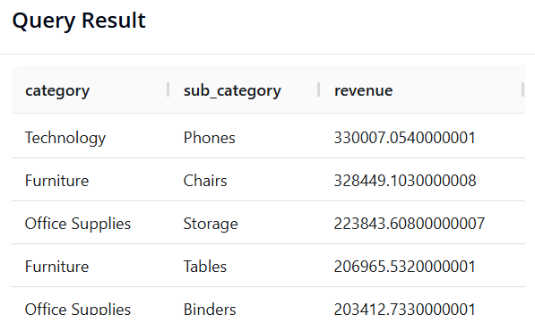
</div>

**Câu 8: Phân tích xu hướng doanh thu theo Năm**

- **Mục tiêu:** Trích xuất năm từ cột ngày đặt hàng (`order_date`) và tính tổng doanh thu theo từng năm để xem đà tăng trưởng.
 - **SQL:**
```sql
SELECT YEAR(order_date) AS order_year, SUM(sales) AS revenue
FROM superstore
GROUP BY order_year
ORDER BY order_year
```
- **Pandas:**
```python
# Chuyển cột order_date về định dạng datetime trước (nếu chưa chuyển)
df['order_date'] = pd.to_datetime(df['order_date'], errors='coerce') 

(df.groupby(df['order_date'].dt.year)['sales']
   .sum()
   .reset_index(name='revenue')
)
```

- **Kết quả:**
<div align="center">
  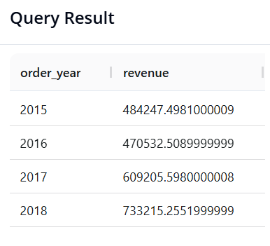
</div>

**Câu 9: Phân tích tính Mùa vụ (Doanh thu theo Tháng-Năm)**

- **Mục tiêu:** Tính tổng doanh thu chi tiết theo từng tháng, nhưng chỉ giới hạn dữ liệu trong năm 2018.
- **SQL:** Chúng ta dùng hàm `DATE_FORMAT()` để định dạng lại ngày tháng thành chuỗi `'Năm-Tháng'`. Ký hiệu `%Y` là năm 4 chữ số, `%m` là tháng 2 chữ số.
```sql
SELECT DATE_FORMAT(order_date, '%Y-%m') AS order_month, SUM(sales) AS total_sales
FROM superstore
WHERE YEAR(order_date) = 2018
GROUP BY order_month
ORDER BY order_month
```
- **Pandas:**
```python
df['order_date'] = pd.to_datetime(df['order_date'], errors='coerce')

result = (
    df[df['order_date'].dt.year == 2018]                
    .assign(order_month=df['order_date'].dt.to_period('M'))
    .groupby('order_month')['sales']                    
    .sum()                                              
    .reset_index(name='revenue')                    
)
result
```

- **Kết quả:**
<div align="center">
  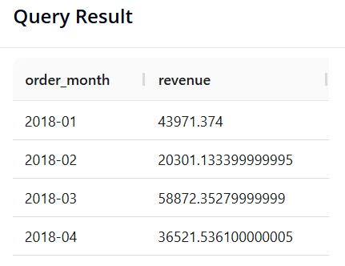
</div>

**Câu 10: Tìm kiếm "Khách hàng VIP"**

- **Mục tiêu:** Phòng Marketing muốn gửi quà tri ân cho các khách hàng VIP. Cần tìm danh sách các khách hàng (`customer_name`) có tổng doanh số (`sales`) mua hàng từ trước đến nay **lớn hơn 14400**, và sắp xếp danh sách này từ cao xuống thấp.
- **SQL:** 
```sql
SELECT customer_name, SUM(sales) AS revenue
FROM superstore
GROUP BY customer_name
HAVING revenue > 14400
ORDER BY revenue DESC
```
- **Pandas:**
```python
result = (
    df.groupby('customer_name')['sales']
    .sum()
    .reset_index(name='revenue')
    .loc[lambda x: x['revenue'] > 14400] 
    .sort_values(by='revenue', ascending=False)
)

result
```

- **Kết quả:**
<div align="center">
  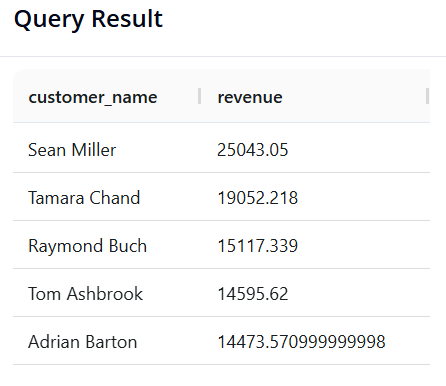
</div>

## **4. KẾT LUẬN: SQL HAY PANDAS? BÀI TOÁN THỰC TẾ**

Ở phần 2 và 3, có lẽ bạn đã thấy cả SQL và Pandas đều có thể giải quyết cùng một bài toán phân tích. Vậy câu hỏi đặt ra là: "Trong thực tế, chúng ta nên ưu tiên sử dụng công cụ nào?".

Câu trả lời phụ thuộc vào 3 yếu cốt lõi sau.
### 4.1. Giới hạn phần cứng và kích thước dữ liệu (Yếu tố quyết định)

- **Pandas (Bị giới hạn bởi RAM):** Pandas tải toàn bộ dữ liệu vào bộ nhớ cục bộ (RAM) của máy tính. Nếu với một tệp dữ liệu 100MB hoặc 1GB, Pandas xử lý rất tốt. Tuy nhiên, nếu bạn cố tải một cơ sở dữ liệu nặng 2 Terabytes (2TB), máy tính của bạn có thể sẽ bị treo hoặc báo lỗi hết bộ nhớ.
    
- **SQL (Sức mạnh của Server):** Cơ sở dữ liệu SQL nằm trên các máy chủ cực mạnh. Nó được thiết kế để quét, tính toán và lọc hàng Terabytes dữ liệu (ví dụ: toàn bộ lịch sử cuộc gọi của một công ty viễn thông lớn) mà không cần phải tải dữ liệu đó về máy cá nhân.

### 4.2. Nguồn lưu trữ và định dạng dữ liệu

<div align="center">
  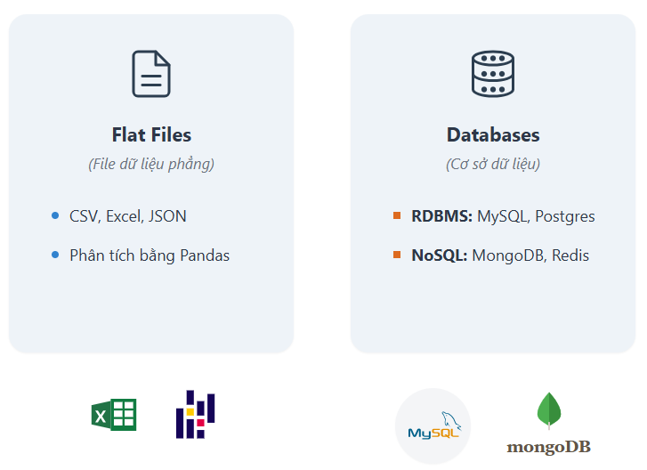
</div>

- Nếu dữ liệu nằm sẵn trong một hệ quản trị cơ sở dữ liệu (Database), **SQL** là công cụ tốt nhất để giao tiếp.
    
- Nếu dữ liệu được cung cấp dưới dạng các tệp phẳng (như `.csv`, `.excel`), hoặc các tập dữ liệu đã được chuẩn bị sẵn (như trên Kaggle), **Pandas** cung cấp một hệ sinh thái tuyệt vời để đọc và phân tích ngay lập tức.
## 4.3. Mục đích của từng giai đoạn

<div align="center">
  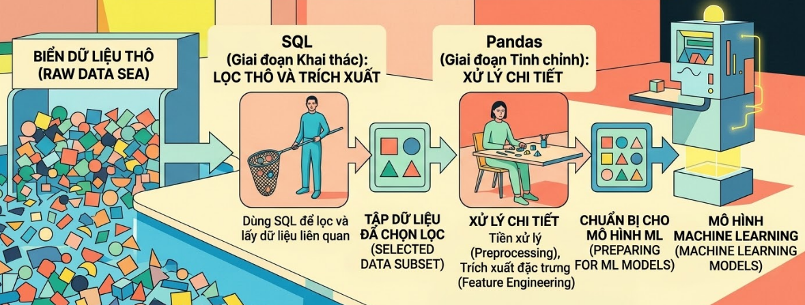
</div>

- **SQL (Giai đoạn Khai thác):** Nhiệm vụ chính là lọc thô và trích xuất. Bạn dùng SQL để chọn ra những phần dữ liệu thực sự liên quan đến mình từ một "biển" dữ liệu khổng lồ.
    
- **Pandas (Giai đoạn Tinh chỉnh):** Nhiệm vụ chính là xử lý chi tiết. Sau khi có tập dữ liệu nhỏ hơn, Pandas tỏa sáng trong việc tiền xử lý (preprocessing), trích xuất đặc trưng (feature engineering) và chuẩn bị dữ liệu cho các mô hình Machine Learning.

## **TÀI LIỆU THAM KHẢO**
- R. Elmasri and S. B. Navathe, _Fundamentals of Database Systems_, 7th ed. Hoboken, NJ, USA: Pearson, 2016.
- The pandas development team, "pandas documentation (Version 1.4)," Feb. 2022. [Online]. Available: [https://pandas.pydata.org/pandas-docs/version/1.4/pandas.pdf](https://pandas.pydata.org/pandas-docs/version/1.4/pandas.pdf). [Accessed: Mar. 11, 2026].
## **MÃ NGUỒN**

- Link: [⭐ Source Code](https://drive.google.com/drive/folders/1hdJ8B67M7aH_8_xJt7-cr7UX7pxvwD6y?usp=drive_link)


