## Motivation

Với **[Project Warmup Đợt 1: Dự báo rủi ro nghỉ việc của nhân sự](https://aioconquer.aivietnam.edu.vn/posts/project-warmup-dot-1-du-bao-rui-ro-nghi-viec-cua-nhan-su)** , nhóm em đã xây dựng mô hình **Random Forest và Logistic Regression** để dự báo attrition và nhận ra rằng việc sử dụng dataset IBM chưa được xử lý kỹ đã khiến hiệu suất mô hình bị giới hạn đáng kể (**Trash in - Trash out**).

Tiếp nối kết quả từ đó, dự án lần này được thực hiện với mục tiêu khắc phục những sai số hệ thống phát sinh từ khâu xử lý dữ liệu đầu vào. Nhận thức được rằng **chất lượng dữ liệu là yếu tố tiên quyết** quyết định hiệu suất mô hình, chúng em tập trung cải thiện toàn diện giai đoạn tiền xử lý để tối ưu hóa độ chính xác cho bài toán dự đoán nhân sự.

Đặc biệt, nghiên cứu lần này mở rộng thêm phạm vi ứng dụng **XAI (Explainable AI)**. Điều này không chỉ giúp kiểm chứng tính đúng đắn của mô hình mà còn cung cấp những góc nhìn chuyên sâu về nguyên nhân nhân viên rời bỏ tổ chức, từ đó hỗ trợ đưa ra các chiến lược quản trị nhân sự hiệu quả hơn.

## I. Tiền Xử Lý Dữ Liệu

### 1. Kiểm Tra Tổng Quát Của Dữ Liệu

#### **1.1. Kiểm tra data bị thiếu và data không hợp lệ**

Như đã đề cập trong **[Project Warmup Đợt 1](https://aioconquer.aivietnam.edu.vn/posts/project-warmup-dot-1-du-bao-rui-ro-nghi-viec-cua-nhan-su)**, dataset IBM HR Analytics trên Kaggle vốn đã khá sạch — không tồn tại **missing data** lẫn **duplicated data**. Kết quả kiểm tra lần này tiếp tục xác nhận điều đó:

```python
miss_count = df.isnull().sum()
miss_pct   = (miss_count / len(df) * 100).round(2)
miss_df    = pd.DataFrame({"Missing Count": miss_count, "Missing %": miss_pct})
miss_df    = miss_df[miss_df["Missing Count"] > 0]

if miss_df.empty:
    print("  No missing values found in any column.")
else:
    fig, ax = plt.subplots(figsize=(10, 4))
    ax.barh(miss_df.index, miss_df["Missing %"], color=SOFT_RED, edgecolor="white")
    ax.set_xlabel("Missing %")
    ax.set_title("Missing Values by Column")
    for i, v in enumerate(miss_df["Missing %"]):
        ax.text(v + 0.2, i, f"{v}%", va="center")
    plt.tight_layout()
    plt.show()
    print(miss_df)

dup_count = df.duplicated().sum()
print(f"  Duplicate rows : {dup_count}")

if dup_count > 0:
    print("\n  Duplicated rows preview:")
    print(df[df.duplicated(keep=False)].head())
else:
    print("  No duplicate rows")
```

**Kết quả:**

| Hạng mục     | Kết quả  |
| ------------ | -------- |
| Số hàng      | 1,470    |
| Số cột       | 35       |
| Missing data | Không có |
| Duplicate    | Không có |

| Logic Check                              | Số vi phạm |
| ---------------------------------------- | ---------- |
| TotalWorkingYears < YearsAtCompany       | 0 row(s)   |
| YearsAtCompany < YearsInCurrentRole      | 0 row(s)   |
| YearsAtCompany < YearsWithCurrManager    | 0 row(s)   |
| YearsAtCompany < YearsSinceLastPromotion | 0 row(s)   |
| Age < 18                                 | 0 row(s)   |
| MonthlyIncome ≤ 0                        | 0 row(s)   |

#### **1.2. Kiểm tra Outliers**

Để phát hiện các giá trị ngoại lệ, nhóm sử dụng phương pháp **IQR (Interquartile Range)** — một kỹ thuật thống kê phổ biến xác định outlier dựa trên khoảng tứ phân vị:

| Ngưỡng      | Công thức      |
| ----------- | -------------- |
| Lower Fence | Q1 - 1.5 × IQR |
| Upper Fence | Q3 + 1.5 × IQR |

Bất kỳ giá trị nào nằm ngoài hai ngưỡng trên đều được xem là **outlier**.

```python
num_cols = df.select_dtypes(include="number").columns.tolist()

outlier_rows = []
for col in num_cols:
    Q1, Q3 = df[col].quantile(0.25), df[col].quantile(0.75)
    IQR    = Q3 - Q1
    lo, hi = Q1 - 1.5 * IQR, Q3 + 1.5 * IQR
    n_out  = ((df[col] < lo) | (df[col] > hi)).sum()
    outlier_rows.append({
        "Column"        : col,
        "Q1"            : round(Q1, 2),
        "Q3"            : round(Q3, 2),
        "Lower Fence"   : round(lo, 2),
        "Upper Fence"   : round(hi, 2),
        "Outlier Count" : n_out,
        "Outlier %"     : round(n_out / len(df) * 100, 2),
    })

outlier_df = (pd.DataFrame(outlier_rows)
              .sort_values("Outlier Count", ascending=False)
              .reset_index(drop=True))
print(outlier_df.to_string(index=False))
```

<div align="center">
  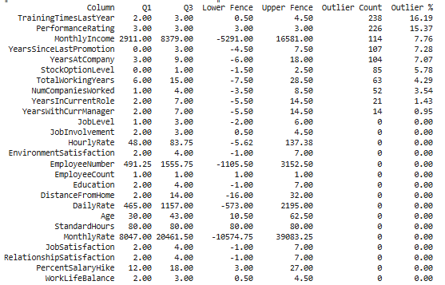
  <p><i>Hình 1: Bảng thống kê outlier theo phương pháp IQR</i></p>
</div>
<div align="center">
  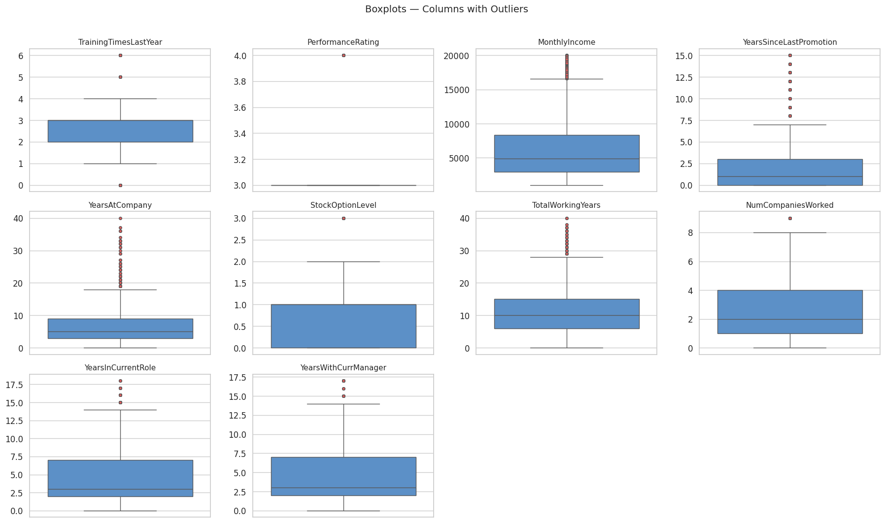
  <p><i>Hình 2: Boxplot phân bố các biến số có outlier</i></p>
</div>

**Kết quả:** Chỉ có một số biến có tỷ lệ outlier đáng kể. Việc xử lý chúng có thể là loại bỏ hoặc tìm cách giảm thiểu. Trong lần này, nhóm quyết định loại bỏ các outliers đó, chỉ giữ lại `MonthlyIncome`, `DailyRate`, `HourlyRate`, `MonthlyRate`.

#### **1.3. Kiểm tra phân bố cột Label (Attrition)**

Tỷ lệ nghỉ việc và ở lại công ty của dataset bị lệch một cách rõ ràng — lớp `No` chiếm áp đảo so với lớp `Yes`. Đây là vấn đề **imbalanced data** điển hình trong bài toán HR.

<div align="center">
  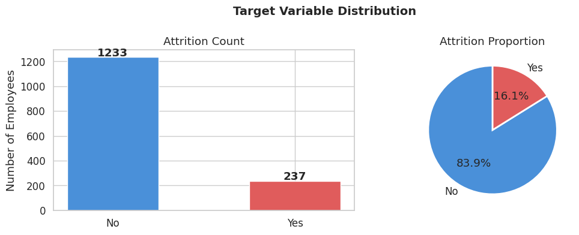
  <p><i>Hình 3: Phân bố tỷ lệ Attrition — Yes vs No</i></p>
</div>

Để khắc phục, nhóm quyết định áp dụng **SMOTE (Synthetic Minority Oversampling Technique)** nhằm tạo ra các mẫu dữ liệu tổng hợp cho lớp thiểu số, cân bằng lại tỷ lệ trước khi đưa vào huấn luyện mô hình. Chi tiết kỹ thuật này sẽ được trình bày ở **Phần III**.

#### **1.4. Phân bố các đặc trưng**

**Numeric Features**

<div align="center">
  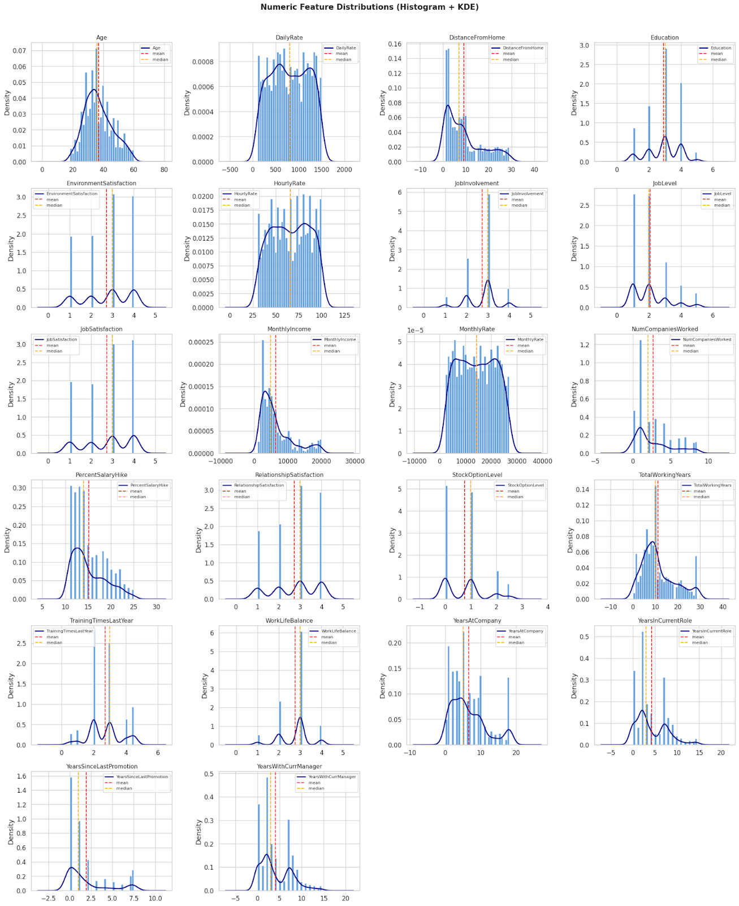
  <p><i>Hình 4: Histogram phân bố các đặc trưng dạng số (Histogram + KDE)</i></p>
</div>

Một số quan sát nổi bật:

- **Độ tuổi (Age):** Lực lượng lao động tập trung đông nhất trong độ tuổi **30–40** — đây là độ tuổi "chín" của sự nghiệp, nơi nhân viên có nhiều lựa chọn thị trường nhất.
- **Thu nhập (MonthlyIncome):** Phân phối **lệch phải (right-skewed)** rất mạnh. Đa số nhân viên có mức lương dưới **10,000**, trong khi chỉ một số ít nhân sự cấp cao có thu nhập đột biến trên **15,000–20,000**.
- **Thâm niên (TotalWorkingYears & YearsAtCompany):** Phần lớn nhân viên có thâm niên tổng thể khoảng **5–10 năm**, nhưng số năm gắn bó với công ty hiện tại thường khá thấp (dưới **5 năm**) — cho thấy tốc độ **luân chuyển nhân sự khá cao**.

**Categorical Features — Các "điểm nóng" gây nghỉ việc**

<div align="center">
  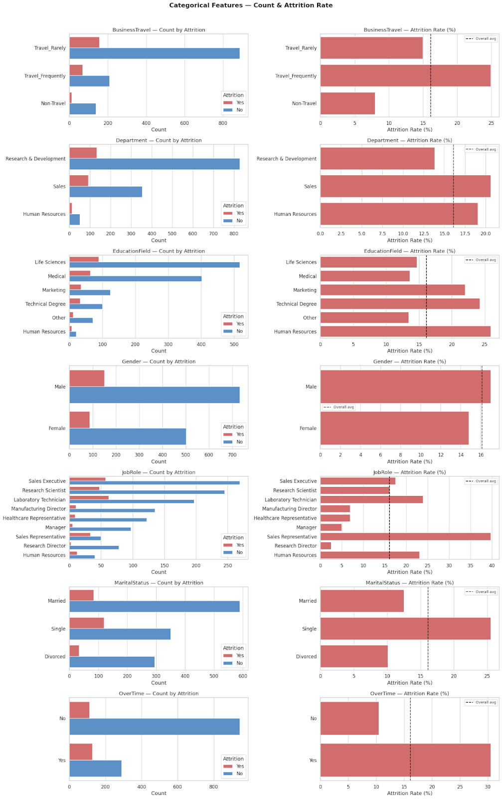
  <p><i>Hình 5: Tỷ lệ Attrition theo từng đặc trưng phân loại</i></p>
</div>

Dựa trên biểu đồ so sánh, có thể nhận diện rõ các yếu tố rủi ro cao:

| Đặc trưng           | Nhóm rủi ro cao      | Tỷ lệ nghỉ việc                                   |
| ------------------- | -------------------- | ------------------------------------------------- |
| **OverTime**        | Làm thêm giờ (`Yes`) | Hơn 30% — gấp 3 lần nhóm không OT (~10%)          |
| **Job Role**        | Sales Representative | Gần **40%** — cao nhất toàn dataset               |
| **Marital Status**  | Single (Độc thân)    | ~**25%** — cao hơn nhóm đã kết hôn/ly hôn         |
| **Business Travel** | Travel_Frequently    | Gần **25%** — áp lực cân bằng công việc–cuộc sống |
| **Department**      | Sales                | Cao hơn rõ rệt so với R&D và HR                   |

> **Nhận xét chung:** Các yếu tố gây nghỉ việc chủ yếu liên quan đến **áp lực công việc** (OT, công tác thường xuyên) và **giai đoạn sự nghiệp** (độc thân, vị trí Sales entry-level). Đây sẽ là những feature quan trọng mà mô hình cần học được — và XAI sẽ giúp kiểm chứng điều này ở phần sau.

### 2. Feature Engineering

#### **2.1. Loại bỏ các cột không có giá trị**

Qua quá trình xem xét, nhóm nhận thấy một số cột cần loại bỏ:

- `EmployeeCount`, `Over18`, `StandardHours` — luôn có giá trị không đổi (zero variance), không mang thông tin cho mô hình
- `EmployeeNumber` — chỉ là ID định danh, không có giá trị học

```python
drop_zero_info = ["EmployeeCount", "Over18", "StandardHours", "EmployeeNumber"]
df.drop(columns=drop_zero_info, inplace=True)
```

#### **2.2. Loại bỏ các cột có tương quan cao**

<div align="center">
  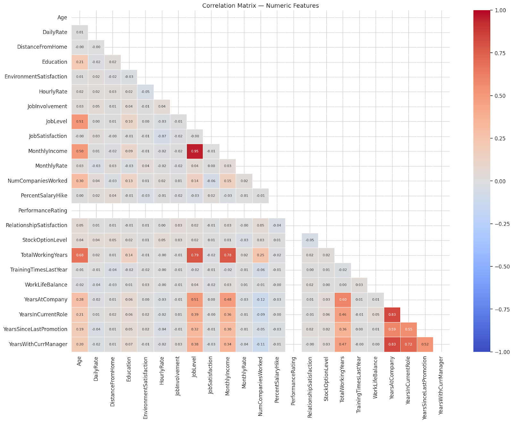
  <p><i>Hình 6: Ma trận tương quan (Correlation Matrix) của các biến số</i></p>
</div>

Dựa vào heatmap tương quan, một số cột có độ tương quan cao với `MonthlyIncome` nên được loại bỏ để tránh **multicollinearity**:

- `MonthlyRate`
- `DailyRate`
- `HourlyRate`

Ngoài ra, cột `PerformanceRating` có **variance gần như bằng 0** nên cũng được loại bỏ.

#### **2.3. Tạo các đặc trưng mới**

Để bổ sung thêm thông tin cho mô hình, nhóm tạo thêm 3 đặc trưng mới:

| Đặc trưng mới  | Công thức                                    | Ý nghĩa                                                   |
| -------------- | -------------------------------------------- | --------------------------------------------------------- |
| `TenureRatio`  | YearsAtCompany / (TotalWorkingYears + 1)     | Mức độ trung thành với công ty hiện tại                   |
| `IncomePerAge` | MonthlyIncome / Age                          | Mức lương tương đối so với độ tuổi                        |
| `PromotionLag` | YearsSinceLastPromotion - YearsInCurrentRole | Mức độ chậm thăng tiến so với thời gian ở vị trí hiện tại |

```python
# Fraction of career spent at current company (loyalty proxy)
df_fe["TenureRatio"] = (
    df_fe["YearsAtCompany"] / (df_fe["TotalWorkingYears"] + 1)
).round(4)

# Monthly income relative to age (career growth proxy)
df_fe["IncomePerAge"] = (
    df_fe["MonthlyIncome"] / df_fe["Age"]
).round(2)

# How far behind on promotions relative to time in current role
df_fe["PromotionLag"] = (
    df_fe["YearsSinceLastPromotion"] - df_fe["YearsInCurrentRole"]
).clip(lower=0)
```

### **3. Xử lý Imbalanced Data**

Sau quá trình phân tích, cột `Attrition` bị lệch rất rõ — lớp `Yes` (nghỉ việc) chiếm tỷ lệ thiểu số so với lớp `No` (ở lại). Để giải quyết vấn đề này, nhóm thử nghiệm và so sánh hai kỹ thuật: **SMOTE-NC** và **CTGAN**.

#### **3.1. SMOTE-NC (Synthetic Minority Oversampling Technique for Nominal and Continuous)**

**Nguyên lý cơ bản**

Thuật toán SMOTE thực hiện phương pháp tăng cường mẫu **(oversampling)** để tái cân bằng tập huấn luyện. Thay vì chỉ đơn thuần sao chép các thực thể thuộc nhóm thiểu số, ý tưởng cốt lõi của SMOTE là tạo ra các **ví dụ tổng hợp (synthetic examples)** bằng cách **nội suy (interpolation)** giữa các mẫu thiểu số trong một vùng lân cận xác định. Quy trình này tập trung vào **"không gian đặc trưng" (feature space)** thay vì "không gian dữ liệu" (data space) — tức là dựa trên giá trị của các đặc trưng và mối quan hệ giữa chúng, thay vì xem xét từng điểm dữ liệu như một chỉnh thể duy nhất.

**SMOTE hoạt động như thế nào?**

**Bước 1 — Xác định lớp thiểu số:** Chọn một mẫu dữ liệu $x_i$ từ tập hợp các mẫu thuộc lớp thiểu số.

**Bước 2 — Tìm láng giềng:** Tìm **k láng giềng gần nhất** (thường dùng k = 5) của **x_i** trong lớp thiểu số, dựa trên khoảng cách Euclidean.

**Bước 3 — Ma trận tương quan (Correlation Matrix) của các biến số\* Chọn một láng giềng:** Chọn ngẫu nhiên một trong k láng giềng đó, gọi là **x_zi**.

**Bước 4 — Tạo mẫu tổng hợp:** Mẫu mới **x_new** được tạo ra theo công thức:

| Thành phần                                        | Ý nghĩa                                   |
| ------------------------------------------------- | ----------------------------------------- |
| $$x_{new} = x_i + \lambda \times (x_{zi} - x_i)$$ | Công thức nội suy                         |
| $x_i$                                             | Vector đặc trưng của mẫu hiện tại         |
| $x_{zi}$                                          | Vector đặc trưng của láng giềng được chọn |
| $λ$                                               | Số thực ngẫu nhiên trong khoảng [0, 1]    |

> **Lưu ý:** Vì SMOTE dựa trên khoảng cách Euclidean và phép trừ vector, nó mặc định tất cả các đặc trưng đều là **số liên tục (continuous)**. Điều này đặt ra vấn đề khi dataset có cả biến phân loại.

<div align="center">
  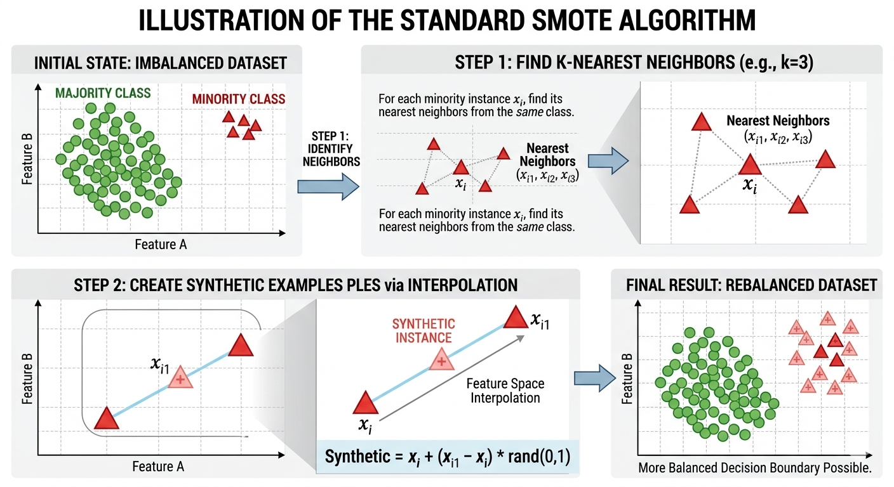
  <p><i>Hình 7: Minh họa thuật toán SMOTE (Nguồn: AI Generated)</i></p>
</div>

Tuy theo gian, kỹ thuật SMOTE đã phát triển để có thể phù hợp cho nhiều bài toán khác nhau. Đối với bài toàn của chúng em có dữ liệu loại Categoric và dữ liệu Numberic. Thì thuật toán SMOTE-NC được cho là tối ưu nhất đối với dataset có hai loại trên

**Tại sao dùng SMOTE-NC?**

Theo thời gian, SMOTE đã phát triển thành nhiều biến thể phù hợp với từng loại bài toán. Với dataset của nhóm có cả **biến Categorical** lẫn **biến Numeric**, thuật toán **SMOTE-NC** được cho là tối ưu nhất.

SMOTE-NC khác SMOTE gốc ở 3 điểm:

**1. Tính khoảng cách có Penalty:**
Vì không thể dùng khoảng cách Euclidean thuần túy cho biến phân loại, SMOTE-NC thêm một giá trị **"Penalty"** vào tổng khoảng cách khi hai mẫu có giá trị phân loại khác nhau. Độ lớn của Penalty dựa trên **độ lệch chuẩn** của các biến số trong dataset.

**2. Tạo mẫu mới cho biến số:**
Vẫn dùng công thức nội suy như SMOTE gốc:

| Công thức                                           | Ý nghĩa                       |
| --------------------------------------------------- | ----------------------------- |
| $$ x*{new_continuous} = x_i + λ × (x*{zi} - x_i) $$ | Nội suy tuyến tính giữa 2 mẫu |

**3. Tạo mẫu mới cho biến phân loại:**
Thay vì nội suy, SMOTE-NC dùng nguyên tắc **Majority Vote** — giá trị của biến phân loại cho mẫu mới sẽ là giá trị xuất hiện **nhiều nhất (mode)** trong số k láng giềng gần nhất.

**Áp dụng SMOTE-NC**

```python
smote_nc = SMOTENC(categorical_features=cat_indices, random_state=42)
X_res, y_res = smote_nc.fit_resample(X_pre, y_pre_encoded)

X_res = pd.DataFrame(X_res, columns=X_pre.columns)
y_res = pd.Series(y_res, name="Attrition").astype(int)
```

#### **3.2. CTGAN (Conditional Tabular GAN)**

**Nguyên lý hoạt động:**

CTGAN là mô hình sinh dữ liệu dựa trên kiến trúc **GAN**, được thiết kế đặc biệt cho dữ liệu dạng bảng. Các cải tiến chính so với GAN thông thường:

- **Mode-specific normalization:** Xử lý phân phối phi Gauss và đa đỉnh của dữ liệu liên tục
- **Conditional Generator:** Xử lý các cột rời rạc bị mất cân bằng
- **Training-by-sampling:** Đảm bảo các giá trị hiếm gặp vẫn được học

```python
# Khởi tạo và train CTGAN trên tập train
ctgan = CTGAN(epochs=100)
ctgan.fit(train_df, discrete_columns)

# Tính số lượng mẫu thiểu số cần sinh thêm
majority_class_count = (train_df['Attrition'] == 'No').sum()
minority_class_count = (train_df['Attrition'] == 'Yes').sum()
samples_to_generate  = majority_class_count - minority_class_count

# Sinh dữ liệu và lọc lấy lớp thiểu số
synth_data = ctgan.sample(samples_to_generate * 10)
synthetic_minority = synth_data[synth_data['Attrition'] == 'Yes'].head(samples_to_generate)

# Ghép với tập train ban đầu
train_ctgan_df = pd.concat([train_df, synthetic_minority])
```

#### **3.3. So sánh kết quả**

<div align="center">
  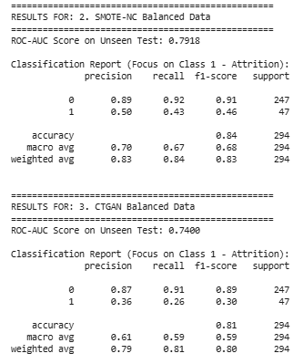
  <p><i>Hình 8: So sánh hiệu suất mô hình giữa hai phương pháp cân bằng dữ liệu</i></p>
</div>

Dựa trên kết quả đánh giá, có thể rút ra một số nhận xét:

- **SMOTE-NC** là lựa chọn tốt nhất — giúp tăng khả năng "bắt" được nhân viên nghỉ việc lên gấp đôi (từ **13% lên 26%**) mà không làm giảm quá nhiều độ chính xác toàn cục.
- **CTGAN** cho kết quả kém nhất về ROC-AUC — thậm chí chỉ số ROC-AUC của CTGAN (**0.7677**) còn thấp hơn cả dữ liệu gốc (**0.7739**). Điều này cho thấy dữ liệu tổng hợp do CTGAN sinh ra đang gây **nhiễu (noise)**, khiến khả năng phân biệt giữa nhân viên ở lại và nghỉ việc bị suy giảm.

## II. Engineering Good Features (Quản lý tốt các thuộc tính đo lường được)

Đôi lúc sẽ có những bộ dữ liệu với nhiều thuộc tính, từ đó dẫn đến các vấn đề sau:

- Nhiều thuộc tính có thông tin dễ bị trùng lặp, gây ra **overfitting**
- Nhiều thuộc tính không cần thiết, hoặc không rõ mức độ ảnh hưởng đến kết quả
- Nhiều thuộc tính không quan trọng nhưng chiếm bộ nhớ, gây lãng phí tài nguyên
- Khi một thuộc tính thay đổi (ví dụ: độ tuổi, tình trạng...), các thuộc tính phụ thuộc cũng cần chỉnh sửa theo

Vậy nếu một thuộc tính không quan trọng, không có ảnh hưởng gì đến kết quả dự đoán, thì chúng ta có thể xóa hoặc cô lập nó khỏi bộ dữ liệu hay không? Và làm sao biết được thuộc tính đó có quan trọng hay không?

> **Feature Importance** có thể hiểu là mức độ đóng góp của một thuộc tính (biến đầu vào) vào khả năng dự đoán của mô hình.

Theo **Chip Huyen** trong _Designing Machine Learning Systems_ (trang 142):

> _"A feature's importance to a model is measured by how much that model's performance deteriorates if that feature or a set of features containing that feature is removed from the model."_
>
> 🇻🇳 "Tầm quan trọng của một đặc trưng được đo bằng mức độ mà hiệu suất của mô hình giảm đi khi ta loại bỏ đặc trưng đó (hoặc loại bỏ một nhóm đặc trưng có chứa nó)."

Nói cách khác, nếu bỏ một đặc trưng mà mô hình vẫn hoạt động tốt và ổn định thì đặc trưng đó không quan trọng — và ngược lại.

Có nhiều phương pháp để xác định mức độ quan trọng của đặc trưng, phân thành các nhóm chính:

| Phương pháp               | Câu hỏi trả lời                                                  | Ứng dụng                                            |
| ------------------------- | ---------------------------------------------------------------- | --------------------------------------------------- |
| **Global Importance**     | "Những đặc trưng nào quan trọng nhất đối với mô hình nói chung?" | Hiểu hành vi tổng thể, hỗ trợ chọn lọc đặc trưng    |
| **Local Importance**      | "Tại sao mô hình đưa ra dự đoán cụ thể này?"                     | Giải thích từng dự đoán, gỡ lỗi quyết định riêng lẻ |
| **Both (Global & Local)** | Cả hai                                                           | Hoạt động ở cả hai phạm vi — tiêu biểu là **SHAP**  |

## III. XAI (Explainable AI)

### 1. XAI là gì?

**XAI (Explainable AI)** hay "AI có thể giải thích được" là một lĩnh vực trong trí tuệ nhân tạo tập trung vào việc tạo ra các mô hình và thuật toán mà con người có thể **hiểu, tin tưởng và quản lý** hiệu quả. XAI ra đời nhằm giải quyết vấn đề **"hộp đen" (black-box)** của các mô hình học máy phức tạp — nơi chúng ta biết đầu vào và đầu ra nhưng không hiểu rõ quy trình ra quyết định bên trong.

<div align="center">
  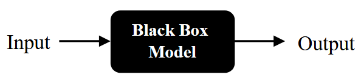
  <p><i>Hình 9: Minh họa cho các mô hình "hộp đen"</i></p>
</div>

### 2. Tại sao cần XAI?

Hãy tưởng tượng chúng ta có một người yêu rất thông minh, tên là AI. AI có thể luôn đúng (nếu người yêu không đúng thì có thể là mình sai) và đoán được mọi thứ (thậm chí đoán được cả việc mình đang giấu quỹ đen ở đâu), nhưng lại mắc tính 'lầm lì'.

Chúng ta đưa cho AI thông tin về tiền lương tháng này (giả dụ khoảng một con bò 🐄), AI phán một câu xanh rờn: "còn thiếu". Khi hỏi lại _"Hay là em tính nhầm?"_, AI chỉ im lặng, mặt không cảm xúc, và liếc nhìn. Đây chính là **"Chiếc hộp đen (Black box)"** — chúng ta biết kết quả nhưng không hiểu lý do.

Chính lúc này, chúng ta cần **XAI** để yêu cầu AI giải thích lý do — đóng vai trò như một "liều thuốc tự sự", bắt người yêu AI phải mở lời.

### 3. Phân loại thuật toán giải thích

Các thuật toán trong XAI được phân loại dựa trên hai tiêu chí chính:

**Thời điểm giải thích:**

| Loại          | Biệt danh              | Mô tả                                                                                                                                                                                                             |
| ------------- | ---------------------- | ----------------------------------------------------------------------------------------------------------------------------------------------------------------------------------------------------------------- |
| **Intrinsic** | "Người yêu thẳng thắn" | Mô hình có cấu trúc đơn giản đến mức bản thân chúng đã là một lời giải thích (Ví dụ như: Decision Tree, Linear Regression,...)                                                                                    |
| **Post-hoc**  | "Người yêu bí ẩn"      | Đây là cách chúng ta xử lý các mô hình "Hộp đen" (như Random Forest hay Neural Networks). Bản thân mô hình này rất phức tạp và lầm lì, nên chúng ta cần một "vị bác sĩ tâm lý" bên thứ ba để vào cuộc và giải mã. |

**Phạm vi áp dụng:**

| Loại       | Mô tả                                                                                   |
| ---------- | --------------------------------------------------------------------------------------- |
| **Global** | Cho biết mô hình "ưu tiên" điều gì trên toàn bộ dữ liệu — hiểu tính nết tổng thể của AI |
| **Local**  | "Soi" đúng tình huống cụ thể — giải thích tại sao mô hình đưa ra một dự đoán riêng lẻ   |

### 4. SHAP

#### **4.1. Giới thiệu về SHAP**

Thuật toán **SHAP** (**Shapley Additive exPlanations**) thuộc loại **Post-hoc**, hoạt động được ở cả phạm vi **Global lẫn Local**. **SHAP** là một trong những công cụ quan trọng nhất trong Machine Learning, một phương pháp **model-agnostic** (không phụ thuộc vào loại mô hình) dùng để giải thích bất kỳ mô hình học máy nào.

Ý tưởng xuất phát từ **lý thuyết trò chơi**: Nếu những người chơi cùng phối hợp để đạt được một thành tựu, liệu có thể phân chia phần thưởng dựa trên mức độ đóng góp của từng người không? Trong bối cảnh học máy, thay "người chơi" bằng **đặc trưng**, "tỉ lệ đóng góp" bằng **Feature Importance**, "thành tựu" bằng **kết quả dự đoán**. SHAP cung cấp một phương pháp phân bổ mức đóng góp của các feature một cách **nhất quán, có nguyên tắc và công bằng về mặt toán học.**

<div align="center">
  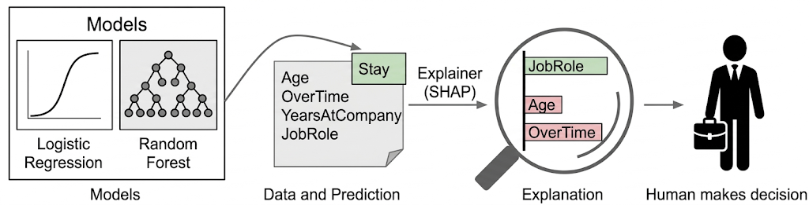
  <p><i>Hình 10: Quy trình giải thích mô hình (XAI) thông qua SHAP (Nguồn: Slide bài giảng AIO_XAI_SHAP)</i></p>
</div>

Quy trình hoạt động của SHAP gồm 4 bước:

- **Đầu vào:**  Như đã đề cập ở trên, SHAP là một phương pháp model-agnostic. Dù là Logistic Regression đơn giản hay Random Forest phức tạp, SHAP đều có thể "thẩm vấn" để tìm ra câu trả lời.
- **Dữ liệu và Dự đoán:** Cung cấp dữ liệu của một đối tượng (Age, OverTime, YearsAtCompany, JobRole...), mô hình đưa ra kết quả dự đoán (ví dụ: nhân viên này sẽ "Stay").
- **Bộ giải thích SHAP:** Dùng nền tảng từ **Game Theory** để phân bổ "phần thưởng" (kết quả dự đoán) cho từng "người chơi" (đặc trưng). Tổng đóng góp của các đặc trưng bằng chính xác mức chênh lệch giữa dự đoán hiện tại và dự đoán trung bình.
- **Kết quả giải thích:** Kết quả được trình bày dưới dạng trực quan hóa mức độ ảnh hưởng:
  - **Màu xanh:** JobRole thể hiện yếu tố đang đẩy dự đoán về hướng "Stay".
  - **Màu đỏ:** Age, OverTime thể hiện yếu tố kéo về hướng ngược lại.
  - Độ dài thanh thể hiện cường độ tác động của tính năng đó mạnh hay yếu.
- Con người đưa ra quyết định: Mục tiêu cuối cùng của XAI không phải là thay thế con người, mà là cung cấp bằng chứng xác thực. Khi nhìn vào biểu đồ SHAP, nhà quản lý không chỉ biết AI dự đoán nhân viên sẽ ở lại, mà còn hiểu rằng "Anh ấy ở lại vì vai trò công việc phù hợp, dù yếu tố tuổi tác và làm thêm giờ đang gây áp lực tiêu cực". Từ đó, con người có thể đưa ra quyết định hoặc điều chỉnh chính sách dựa trên sự hiểu biết thấu đáo.

#### **4.2. Kernel SHAP**

Kernel SHAP xấp xỉ giá trị Shapley bằng cách kết hợp **Lý thuyết trò chơi** và **Hồi quy tuyến tính có trọng số**. Thay vì tính toán chính xác tất cả tổ hợp đặc trưng, Kernel SHAP ước lượng đóng góp của từng biến qua 3 bước:

1. **Lấy mẫu (Perturbation):** Tạo các biến thể của dữ liệu gốc bằng cách giữ lại một số đặc trưng và thay thế phần còn lại bằng giá trị ngẫu nhiên hoặc trung bình.
2. **Dự đoán:** Đưa các biến thể qua mô hình hộp đen để thu về kết quả dự đoán tương ứng.
3. **Hồi quy tuyến tính có trọng số:** Huấn luyện một mô hình hồi quy đơn giản trên các mẫu này. Đặc biệt, các mẫu có ít hoặc gần đủ số lượng đặc trưng được gán trọng số cao hơn (Shapley Kernel). Hệ số của mô hình hồi quy chính là Shapley value xấp xỉ.

<div align="center">
  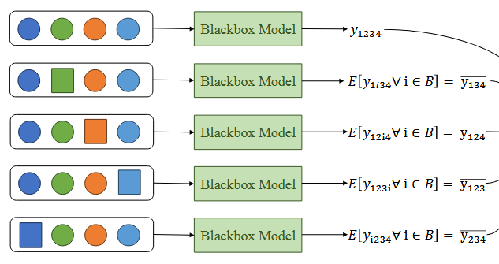
  <p><i>Hình 11: Cơ chế hoạt động của Kernel SHAP (Nguồn: Slide bài giảng AIO_XAI_SHAP) </i></p>
</div>

> ✅ **Khi nào dùng Kernel SHAP:** Khi đối mặt với mô hình "lạ" hoặc không phải dạng cây — Kernel SHAP là công cụ đáng tin cậy nhất để mang lại tính minh bạch.

#### **4.3. Tree SHAP**

Tree SHAP được thiết kế đặc biệt để tính giá trị Shapley cho **các mô hình dạng cây** một cách nhanh chóng và chính xác. Thay vì coi mô hình là hộp đen, Tree SHAP **đọc trực tiếp cấu trúc phân cấp** (nút, nhánh, lá) của cây:

1. **Duyệt cây:** Thuật toán duyệt qua tất cả đường đi từ gốc đến lá đồng thời cho mọi tổ hợp đặc trưng.
2. **Trọng số đường đi:** Tại mỗi nút quyết định, nếu đặc trưng "bị tắt", thuật toán tính trung bình trọng số của cả hai nhánh dựa trên số lượng mẫu đi qua trong lúc huấn luyện.
3. **Tổng hợp:** Tổng hợp đóng góp từ tất cả các cây trong mô hình Ensemble để ra con số cuối cùng.

> ✅ **Khi nào dùng Tree SHAP:** Dữ liệu dạng bảng (Tabular) với mô hình **Random Forest, XGBoost, LightGBM, CatBoost, Decision Tree**, đặc biệt khi cần giải thích toàn cục (Global).

### 5. Áp dụng SHAP cho bài toán HR Attrition

#### **5.1. Mô hình Logistic Regression**

**Khởi tạo và huấn luyện**

```python
# 1. Khởi tạo mô hình
black_box_lr = LogisticRegression(penalty="l2", C=0.1, max_iter=1000, random_state=42)

# 2. Huấn luyện mô hình
black_box_lr.fit(X_train, y_train)

# 3. Dự đoán và đánh giá
y_pred = black_box_lr.predict(X_test)
print(classification_report(y_test, y_pred))
```

Mô hình được khởi tạo với ba siêu tham số quan trọng:

- `penalty="l2"`: Áp dụng regularization **L2 (Ridge)** — thêm số hạng phạt bằng tổng bình phương các hệ số, buộc mô hình giữ hệ số nhỏ, hạn chế overfitting.
- `C=0.1`: Nghịch đảo của cường độ regularization. Giá trị nhỏ = regularization mạnh → biên quyết định đơn giản, tổng quát hóa tốt hơn.
- `max_iter=1000`: Số vòng lặp tối đa cho thuật toán tối ưu hóa. Nếu xuất hiện `ConvergenceWarning`, có thể cần tăng giá trị này hoặc chuẩn hóa dữ liệu đầu vào.

**Kết quả đánh giá**

<div align="center">
  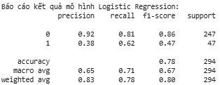
  <p><i>Hình 12: Kết quả đánh giá mô hình Logistic Regression</i></p>
</div>

**Giải thích bằng Kernel SHAP**

```python
# Định nghĩa hàm dự đoán xác suất
def predict_proba_lr(X):
    return black_box_lr.predict_proba(X)

# Lấy mẫu 100 điểm từ tập train làm background dataset
X_train_sampled = shap.utils.sample(X_train, 100)

# Khởi tạo Kernel SHAP Explainer
explainer_lr = shap.KernelExplainer(predict_proba_lr, X_train_sampled)

# Tính giá trị SHAP cho tập test
shap_values = explainer_lr.shap_values(X_test)

# Trực quan hóa summary plot cho lớp positive (Attrition = 1)
shap.summary_plot(shap_values[:, :, 1], X_test)
```

- `predict_proba_lr(X)`: Wrapper bọc lại `predict_proba()` — Kernel SHAP cần hàm trả về **xác suất** (không phải nhãn rời rạc) để tính SHAP liên tục và chính xác hơn.
- `shap.utils.sample(X_train, 100)`: Lấy 100 mẫu ngẫu nhiên làm **background dataset** — tập tham chiếu để ước tính "giá trị kỳ vọng khi thiếu đặc trưng". Dùng 100 mẫu thay vì toàn bộ tập train giúp giảm đáng kể thời gian tính toán.
- `shap_values[:, :, 1]`: Trích xuất SHAP values cho **Class 1 (Attrition = Yes)**.
- `shap.summary_plot(...)`: Biểu đồ tổng quan — mỗi điểm là một mẫu; **màu đỏ** = giá trị đặc trưng cao, **màu xanh** = giá trị thấp; vị trí trên trục x thể hiện mức tăng/giảm xác suất nghỉ việc.

<div align="center">
  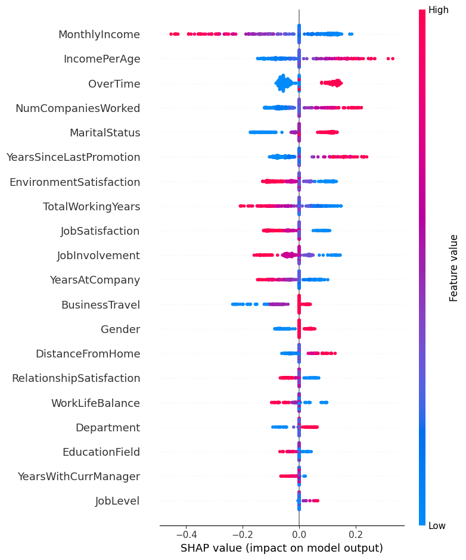
  <p><i>Hình 13: SHAP Summary Plot cho mô hình Logistic Regression</i></p>
</div>

#### **5.2. Mô hình Random Forest**

**Khởi tạo và huấn luyện**

```python
# 1. Khởi tạo mô hình Random Forest
black_box_rf = RandomForestClassifier(n_estimators=100, random_state=42)

# 2. Huấn luyện mô hình
black_box_rf.fit(X_train, y_train)

# 3. Dự đoán và đánh giá
y_pred_rf = black_box_rf.predict(X_test)
print(classification_report(y_test, y_pred_rf))
```

**Random Forest** là thuật toán **ensemble learning** — xây dựng nhiều cây quyết định độc lập trên các tập con dữ liệu và đặc trưng khác nhau (kỹ thuật **bagging**), sau đó tổng hợp kết quả theo nguyên tắc **bỏ phiếu đa số**. Cách tiếp cận này giúp mô hình ổn định hơn, giảm phương sai và kháng overfitting so với cây đơn lẻ.

- `n_estimators=100`: Xây dựng 100 cây — cân bằng giữa hiệu suất và chi phí tính toán.
- `random_state=42`: Cố định hạt ngẫu nhiên để đảm bảo kết quả tái lập được.

**Kết quả đánh giá**

<div align="center">
  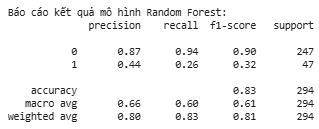
  <p><i>Hình 14: Kết quả đánh giá mô hình Random Forest</i></p>
</div>

**Giải thích bằng Tree SHAP**

```python
# 1. Khởi tạo TreeExplainer
explainer_rf = shap.TreeExplainer(black_box_rf)

# 2. Tính toán giá trị SHAP cho tập test
shap_values_rf = explainer_rf.shap_values(X_test)

# 3. Trực quan hóa summary plot cho lớp positive (Attrition = 1)
if isinstance(shap_values_rf, list):
    shap.summary_plot(shap_values_rf, X_test)[1]
else:
    shap.summary_plot(shap_values_rf[:, :, 1], X_test)
```

- `shap.TreeExplainer(black_box_rf)`: Explainer chuyên dụng cho mô hình dạng cây.
- `isinstance(shap_values_rf, list)`: Tùy phiên bản SHAP, kết quả trả về có thể là **list 2D** hoặc **mảng 3D**.

<div align="center">
  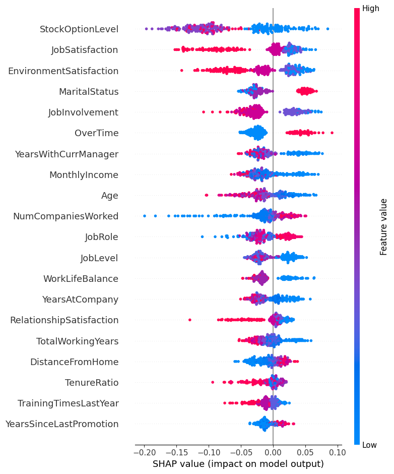
  <p><i>Hình 15: SHAP Summary Plot cho mô hình Random Forest</i></p>
</div>

## Tổng kết

Dự án đã chuyển đổi mô hình dự báo rủi ro nghỉ việc từ phương pháp truyền thống sang quy trình **Data-Centric AI** kết hợp **XAI (Explainable AI)**, giúp giải quyết bài toán "dữ liệu rác" từ các giai đoạn trước. Thông qua việc làm sạch, kỹ thuật đặc trưng và áp dụng thuật toán **SMOTE-NC** để cân bằng dữ liệu, nhóm đã cải thiện đáng kể hiệu suất mô hình, đặc biệt là tăng khả năng nhận diện nhóm nhân sự có nguy cơ nghỉ việc lên gấp đôi. Kết quả này chuyển hóa những con số khô khan thành các chiến lược quản trị nhân sự thực tiễn, giúp doanh nghiệp chủ động đưa ra các giải pháp giữ chân nhân tài một cách khoa học và hiệu quả.

## Tài liệu tham khảo

[1] N. V. Chawla, K. W. Bowyer, L. O. Hall, and W. P. Kegelmeyer, "SMOTE: synthetic minority over-sampling technique," _J. Artif. Intell. Res._, Jun. 2002.
Xem tại: https://doi.org/10.1613/jair.953

[2] L. Xu, M. Skoularidou, A. Cuesta-Infante, and K. Veeramachaneni, "Modeling tabular data using conditional GAN," in _Advances in Neural Information Processing Systems_, 2019, vol. 32.
Xem tại: https://arxiv.org/abs/1907.00503

[3] V. Kovanović, S. Joksimović, and G. Siemens, "Explaining a probabilistic prediction on the simplex with Shapley compositions," _Nature Machine Intelligence_ Jan. 2024.
Xem tại: https://arxiv.org/abs/2408.01382

[4] A. J. Barda, J. W. Gichoya, and S. Purkayastha, "Mind the XAI Gap: A Human-Centered LLM Framework for Democratizing Explainable AI," _arXiv preprint arXiv:2404.14535_, 2024.
Xem tại: [https://arxiv.org/abs/2404.14535](https://arxiv.org/abs/2404.14535)

[5] V. Kovanović, S. Joksimović, and G. Siemens, "Explaining a probabilistic prediction on the simplex with Shapley compositions," _Nature Machine Intelligence_, Jan. 2024.
Xem tại: [https://arxiv.org/html/2408.01382v1#S1](https://arxiv.org/html/2408.01382v1#S1)

[6] Truong-Binh Duong, Nguyen-Phuc Thinh. , và Dinh-Quang Vinh (2025), "XAI Introduction: LIME and ANCHOR,".
AIO Tutorial: https://tutorial.aivietnam.edu.vn/pdf/39/info

[7] L.H.Anh Duy (2025) "Explainable AI với SHAP: Từ lý thuyết đến ứng dụng".
AIO Conquer: https://aioconquer.aivietnam.edu.vn/posts/report-giai-thuat-shap-trong-explainable-ai

[8] L.D.Hoang, N.X.Tien, T.T.Tai, P.C.Tan (2026) "Dự báo rủi ro nghỉ việc của nhân sự".
AIO Conquer: https://aioconquer.aivietnam.edu.vn/posts/project-warmup-dot-1-du-bao-rui-ro-nghi-viec-cua-nhan-su

## Mã nguồn tham khảo

- Link: [⭐ Source Code](https://drive.google.com/drive/folders/1t5Ci3robdkT4bXtKO-g8qTODO67r3Yzx)
